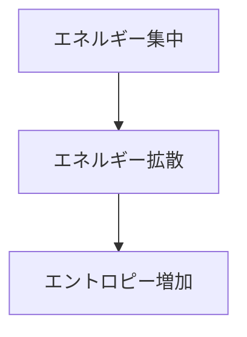
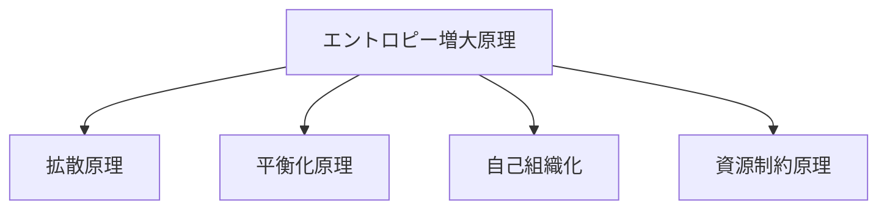

# エントロピー増大原理

## 定義

孤立系において、  
**エントロピー（無秩序の指標）は時間とともに増大する方向に変化する。**

これを **エントロピー増大原理（Second Law of Thermodynamics）** という。

簡単に言うと

**エネルギーは使われるほど散らばり、  
秩序は自然には維持されない。**

---

# 基本構造



---

# 原理の意味

この原理は

- 熱力学
- 物理
- 生物
- 情報
- 社会

など多くの分野で現れる。

本質は

**エネルギーと情報は自然には拡散する**

ということである。

---

# 典型的な現象

## 熱拡散

熱は高温から低温へ広がる。

例

- 熱湯が冷める
- 金属が均一な温度になる

---

## 混合

物質は自然に混ざる。

例

- インクが水に広がる
- 気体が容器内で均一化する

---

## 構造崩壊

秩序は維持しなければ崩れる。

例

- 建物の劣化
- 機械の摩耗
- 組織の崩壊

---

# 秩序はなぜ維持できるのか

秩序を維持するには

**外部からエネルギーを投入する必要がある。**

例

|対象|必要なエネルギー|
|---|---|
|生物|代謝|
|都市|インフラ|
|組織|管理|
|情報|計算|

---

# Kernelとの関係



---

# 拡散との関係

エントロピー増大は

```
エントロピー増大
↓
拡散
↓
均一化
```

として現れる。

---

# 平衡化との関係

エネルギーは最終的に

**平衡状態**

へ向かう。

例

- 温度平衡
- 圧力平衡
- 化学平衡

---

# 自己組織化との関係

一見すると矛盾するが

```
局所秩序
↓
エネルギー消費
↓
全体エントロピー増加
```

なので矛盾しない。

例

- 生命
- 渦
- 結晶

---

# 他分野での現れ

## 生物

生命は

**エントロピーに抗して秩序を維持するシステム**

である。

---

## 情報

情報処理では

- ノイズ増大
- 情報劣化

として現れる。

---

## 社会

社会でも

- 組織崩壊
- 制度劣化
- 都市衰退

として現れる。

---

# mechanism

エントロピー増大から生まれるメカニズム

- 拡散メカニズム
- 劣化メカニズム
- 散逸構造メカニズム

---

# pattern

典型的パターン

- 情報劣化
- 組織崩壊
- 都市衰退
- システム疲労

---

# case

- 建築物の風化  
- データ劣化  
- 生態系崩壊  
- 組織の官僚化

---

# 見分けるための問い

- この秩序はエネルギー無しで維持できるか  
- 何が散逸しているか  
- 拡散を止めている構造は何か  
- どこにエネルギーが投入されているか  

---

# 要約

エントロピー増大原理とは

**エネルギーと情報は自然には拡散し、  
秩序は維持しなければ崩れる**

という原理である。

したがって

**秩序はコストを必要とする。**