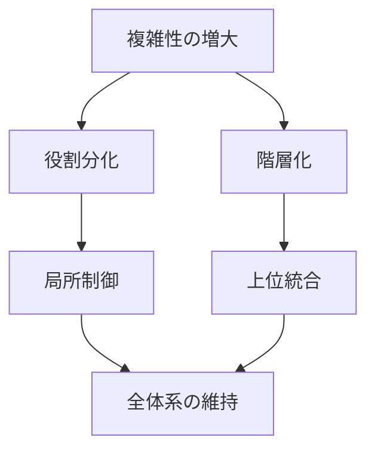
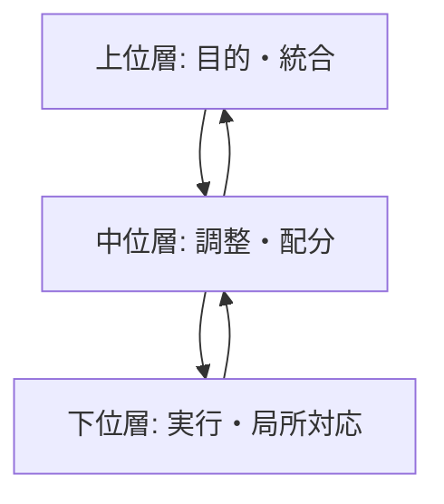

# 階層原理

## 定義

要素数・機能・空間・時間の複雑性が増大すると、  
システムはその複雑性を処理するために  
**層・段階・レベルを持つ構造**を形成する。

この原理を **階層原理** という。

簡単に言えば、

**複雑なものは、平面のままでは保てず、層になる。**

---

## 要点

階層原理が意味するのは、単なる上下関係ではない。

本質は

- 全体を分割する
- 局所単位に処理を委ねる
- 上位層は抽象化と統合を担う
- 下位層は具体的実行を担う

という

**複雑性管理の原理**

である。

---

# 基本構造



---

# なぜ階層が必要になるのか

## 1 全部を一箇所で処理できない

要素が少ないうちは  
単一の主体や単一のルールで処理できる。

しかし規模が拡大すると、

- 情報量
- 判断量
- 調整量

が増えすぎて、中央だけでは処理できなくなる。

---

## 2 分業が必要になる

複雑性が増えると、  
異なる仕事を同じ主体が担うのは非効率になる。

そのため

- 実行層
- 管理層
- 設計層

のような層分化が生じる。

---

## 3 抽象化が必要になる

上位層は下位層の全情報をそのまま扱えない。

そのため

- 要約
- 指標化
- ルール化
- 標準化

が必要になる。

---

## 4 制御範囲に限界がある

一人・一部門・一組織が直接制御できる範囲には限界がある。

そのため  
中間層が生まれる。

---

# 階層の典型構造

## 1 上位層

- 目的設定
- 方針決定
- 全体統合

---

## 2 中位層

- 翻訳
- 配分
- 監督
- 調整

---

## 3 下位層

- 実行
- 現場対応
- 具体処理

---

# 基本図



---

# [[02_zettelkasten/Zettelkasten Engine/01_knowledge/world_model/meta/kernel/physics/スケール原理]]との関係

階層原理は  
[[02_zettelkasten/Zettelkasten Engine/01_knowledge/world_model/meta/kernel/physics/スケール原理]]の主要な帰結の一つである。

```
規模拡大
↓
相互作用増大
↓
調整困難
↓
階層化
```

小規模では不要だった階層が、  
大規模では不可避になる。

---

# [[02_zettelkasten/Zettelkasten Engine/01_knowledge/world_model/meta/kernel/physics/相互作用原理]]との関係

相互作用が増えると、  
全員が全員と直接つながるのは不可能になる。

その結果、

- 窓口
- 部門
- ハブ
- 管理職

などが生まれる。

つまり階層は

**相互作用の交通整理装置**

でもある。

---

# [[フィードバック]]との関係

階層は一方通行ではない。

本来は

- 上から下への指示
- 下から上への報告
- 横の調整

という複数の [[フィードバック]] 回路を持つ。

階層が硬直すると、  
このフィードバックが詰まる。

---

# [[02_zettelkasten/Zettelkasten Engine/01_knowledge/world_model/meta/kernel/complex/自己組織化]]との関係

階層は必ずしも上から設計されるとは限らない。

多くのシステムでは

- 頻繁に調整する主体
- 情報を集める主体
- 配分を担う主体

が自然に中心化し、  
結果として階層が形成される。

つまり階層は  
[[02_zettelkasten/Zettelkasten Engine/01_knowledge/world_model/meta/kernel/complex/自己組織化]]の産物でもある。

---

# [[非線形性]]との関係

階層は連続的ではなく、  
ある規模や複雑性を超えると急に必要になる。

たとえば

- 10人の集団
- 100人の組織
- 1万人の都市

では必要な構造が質的に変わる。

この意味で階層形成は  
[[非線形性]]を伴う。

---

# 各領域での例

## 組織

- 社長
- 部長
- 課長
- 現場

---

## 生物

- 細胞
- 組織
- 器官
- 個体

---

## 都市

- 住宅
- 街区
- 地区
- 都市
- 都市圏

---

## 国家

- 地方
- 行政機関
- 中央政府

---

## 技術

- 部品
- モジュール
- システム
- システム群

---

# 階層の利点

- 複雑性を分割できる
- 制御可能性が増す
- 専門化できる
- 拡張しやすい
- 局所問題を局所で処理できる

---

# 階層のコスト

- 情報が歪む
- 中間層が肥大化する
- 責任が曖昧になる
- 現場と上層が乖離する
- 硬直化する

このため階層原理は  
単なる利点ではなく、

**複雑性管理の代償付き解法**

である。

---

# mechanism

階層原理と接続しやすいメカニズム

- 階層形成メカニズム
- 官僚化メカニズム
- 情報要約メカニズム
- 権限委譲メカニズム
- 中間管理生成メカニズム

---

# pattern

階層原理から現れやすいパターン

- 官僚化パターン
- サイロ化パターン
- 意思決定遅延パターン
- 中央集権化パターン
- 分権統治パターン

---

# case

- 帝国統治機構
- 官僚国家
- 大企業組織
- 学校制度
- 多層サプライチェーン

---

# 見分けるための問い

- この対象は何層に分かれているか
- 上位層は何を抽象化しているか
- 下位層は何を具体的に処理しているか
- 中間層は何を翻訳しているか
- フィードバックは上に戻っているか
- 階層は機能しているか、硬直しているか

---

# 要約

階層原理とは、

**複雑性が増大すると、システムは層構造を形成して  
分割・統合・制御を可能にする**

という原理である。

したがって、複雑な対象を理解するときは  
要素そのものだけでなく、

**どの階層で何が処理されているか**

を見なければならない。