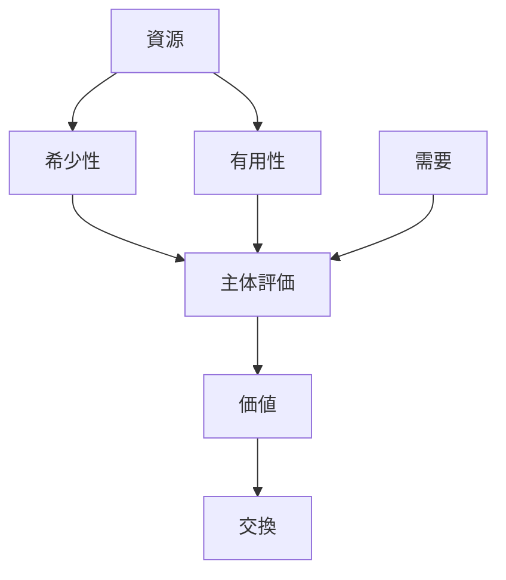
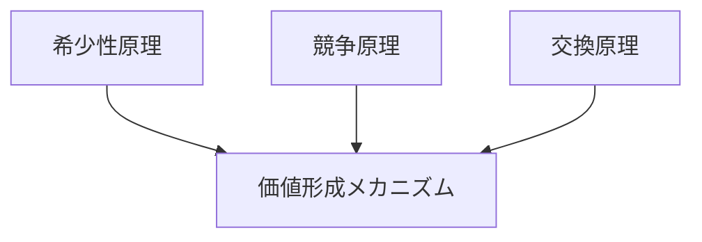

# 価値形成メカニズム

## 定義

主体が資源の希少性・有用性・交換可能性を評価することで  
**価値が生成される過程**を

**価値形成メカニズム（Value Formation Mechanism）**

という。

価値は物理的属性ではなく

**主体の評価と社会構造によって生成される。**

---

# 基本構造



---

# メカニズムの流れ

価値形成は次の順序で発生する。

```
資源
↓
希少性
↓
主体評価
↓
価値
↓
交換
```

---

# 重要な要素

## 希少性

資源が有限である。

例

- 土地
- 石油
- 時間

---

## 有用性

主体にとって役に立つ。

例

- 食料
- 道具
- 情報

---

## 主体評価

主体が価値を判断する。

評価は

- 個人
- 集団
- 社会

によって異なる。

---

# 社会構造との関係

価値は社会制度によって変化する。

例

|制度|価値|
|---|---|
|市場|価格|
|政治|権力|
|文化|名誉|

---

# Kernelとの関係

価値形成メカニズムは次の原理から生まれる。



---

# Pattern

このメカニズムは次のパターンを生む。

- [[市場競争]]
- [[価格形成]]
- [[ブランド価値]]
- [[希少価値]]

---

# Case

例

- ダイヤモンド価格
- 不動産価格
- 株式市場
- NFT

---

# 応用領域

価値形成は次の領域で現れる。

## 経済

価格

---

## 社会

地位

---

## 情報

注意

---

## 文化

名声

---

# 要約

価値は

```
希少性
×
有用性
×
主体評価
```

から生成される。

つまり価値とは

**社会的に形成される現象である。**