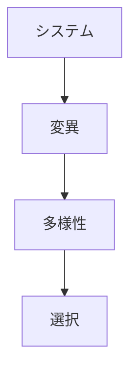
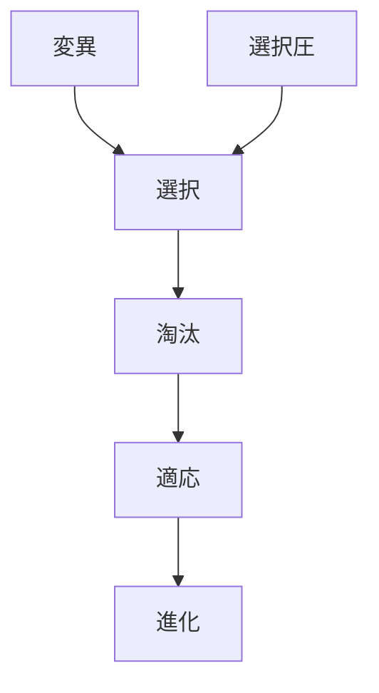

# 変異

## 定義

個体・主体・システムにおいて  
形質・構造・行動・戦略が

**ランダムまたは偶発的に変化する現象**

を **変異（Variation / Mutation）** という。

---

# 基本構造



---

# 変異の本質

変異とは

```
同じものが
同じでなくなる
```

ことである。

つまり

**差を生む生成過程**

である。

---

# なぜ変異が重要か

もし変異がなければ

```
多様性
↓
ゼロ
```

になる。

すると

```
選択
適応
進化
```

は起こらない。

つまり変異は

**進化の材料**

である。

---

# 変異の種類

## 生物変異

- 遺伝子変異
- 突然変異
- 組換え

---

## 行動変異

- 試行錯誤
- 新しい行動
- 戦略変更

---

## 技術変異

- 新技術
- 新設計
- 改良

---

## 組織変異

- 新制度
- 新戦略
- 新構造

---

# kernelとの関係



---

# 変異と探索

探索は

```
新しい可能性を試す
```

行為である。

したがって探索は

**意図的な変異生成**

と見ることができる。

---

# 各領域での例

## 生物

- 遺伝子突然変異
- 形質変化

---

## 技術

- 新製品
- 新技術

---

## 経済

- 新ビジネスモデル
- 新市場

---

## 組織

- 業務改善
- 組織改革

---

# pattern

変異から現れやすいパターン

- 多様化
- イノベーション
- 分化
- 技術進化

---

# case

- 遺伝子突然変異
- 新技術発明
- ビジネスモデル革新
- ソフトウェア更新

---

# 見分けるための問い

- 何が変化しているか
- その変化は偶発か意図か
- どんな多様性を生んでいるか
- その変異は選択対象になるか

---

# 要約

変異とは

**形質・構造・行動・戦略の偶発的または試行的変化**

であり、  
選択・