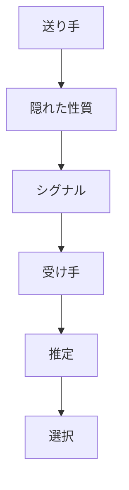
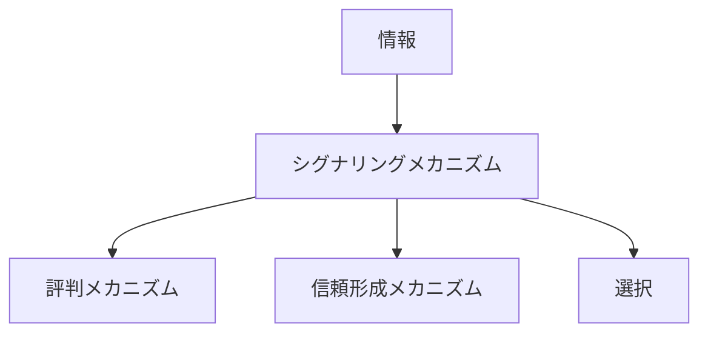

# シグナリングメカニズム

## 定義

主体が自分の

- 品質
- 能力
- 意図
- 信頼性
- 立場

などを他者に伝えるために、  
観察可能な行動や属性を示し、

**情報の非対称性を埋める仕組み**

を **シグナリングメカニズム** という。

---

# 基本構造



つまり

```text
隠れた性質
↓
観察可能なシグナル
↓
受け手の推定
↓
選択
```

である。

---

# シグナリングの本質

## 1 直接見えないものを見せる

多くの重要な性質は直接観察できない。

例

- 能力
- 誠実性
- 商品品質
- 長期的意図

そのため主体は  
それを示す手がかりを出す。

---

## 2 情報非対称を埋める

送り手は自分のことを知っているが、  
受け手は十分に知らない。

この差を埋めるのがシグナルである。

---

## 3 シグナルは解釈される

重要なのは、シグナルそのものではなく  
**受け手が何を推定するか** である。

同じ行動でも文脈によって意味が変わる。

---

# 良いシグナルの条件

## 1 観察可能である

受け手が確認できる必要がある。

---

## 2 偽装コストがある

誰でも簡単に真似できるなら  
シグナルとして弱い。

例

- 長い訓練
- 継続実績
- 高い投資

---

## 3 隠れた性質と結びついている

シグナルが本当に

```text
能力
品質
誠実性
```

と関係している必要がある。

---

# kernelとの関係



---

# 情報との関係

シグナリングは

**情報伝達の特殊形**

である。

ただし単なる情報伝達ではなく、  
見えない性質を推定させる点が特徴である。

---

# 評判との関係

評判は過去の行動の蓄積だが、  
シグナルは現在の観察可能な手がかりである。

両者は組み合わさることで  
信頼判断を支える。

---

# 信頼との関係

受け手はシグナルを見て

```text
信頼できるか
能力があるか
本気か
```

を判断する。

したがってシグナリングは  
信頼形成の前段階を担う。

---

# インセンティブとの関係

良いシグナルを出すと

- 採用される
- 取引される
- 協力される
- 高く評価される

ため、主体にはシグナルを出す誘因がある。

---

# シグナルの例

## 能力シグナル

- 学位
- 資格
- 実績
- ポートフォリオ

---

## 信頼性シグナル

- 継続履歴
- 契約履行
- 第三者認証
- 保証

---

## 意図のシグナル

- 長期投資
- 先行出資
- 丁寧な対応
- ルール遵守

---

## 品質シグナル

- ブランド
- 価格
- デザイン
- 素材表示

---

# 各領域での例

## 労働市場

- 学歴
- 職歴
- 資格

---

## 経済

- ブランド広告
- 高価格設定
- 保証制度

---

## 組織

- 服装
- 役職
- 発言態度
- 成果履歴

---

## デジタル

- 認証バッジ
- フォロワー数
- レビュー
- 実績表示

---

# pattern

シグナリングメカニズムから現れやすいパターン

- ブランド形成
- 見せ金行動
- 権威演出
- 模倣競争
- 選抜強化

---

# case

- 学歴による採用判断
- 高価格ブランド
- 認証バッジ付きアカウント
- 実績公開による受注
- 保証付き商品の信頼獲得

---

# 見分けるための問い

- 隠れていて直接見えない性質は何か
- どの行動や属性がシグナルになっているか
- そのシグナルは観察可能か
- 偽装コストは高いか
- 受け手は何を推定しているか

---

# 要約

シグナリングメカニズムとは

**主体が観察可能な手がかりを通じて、自分の隠れた性質や意図を他者に推定させる仕組み**

であり、

```text
隠れた性質
↓
シグナル
↓
推定
↓
選択
```

という過程を通じて  
信頼、選別、取引、評価を成立させる。