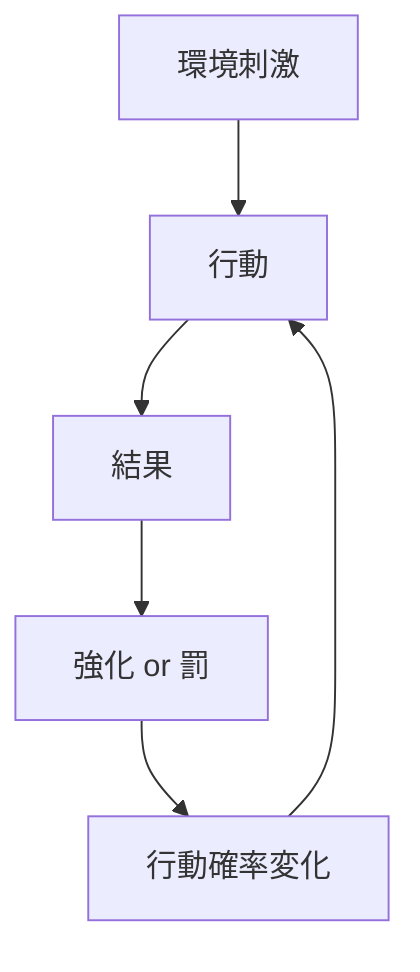
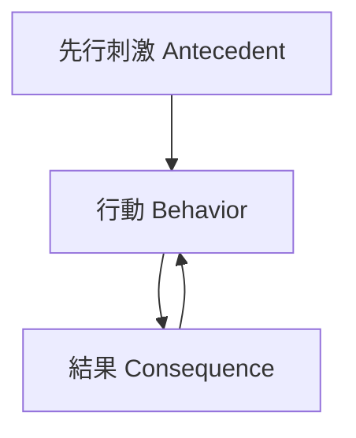
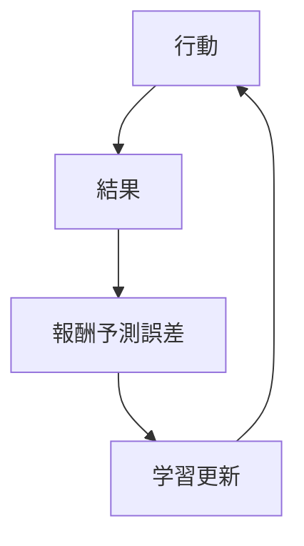

# オペラント条件づけ構造  
Operant Conditioning Structure

オペラント条件づけとは、行動の結果（報酬・罰）がその行動の発生確率を変化させる学習メカニズムである。
B.F.スキナーによって体系化された。

---

# 基本構造

# 三項随伴性

オペラント条件づけは三項随伴性（three-term contingency）で説明される。

# 強化の分類
## 正の強化

望ましい刺激を与える

例
- 報酬    
- 賞賛    
- 金銭    

行動は増える

---

## 負の強化

不快刺激を取り除く

例
- 宿題免除    
- 苦痛の解消    

行動は増える

---

## 正の罰

不快刺激を与える

例
- 叱責    
- 罰金    

行動は減る

---

## 負の罰

望ましい刺激を奪う

例
- スマホ没収    
- 特権剥奪    

行動は減る

---

# 強化スケジュール

行動の持続性は報酬スケジュールで決まる。

|タイプ|特徴|例|
|---|---|---|
|固定比率|回数ごと|営業歩合|
|変動比率|ランダム回数|ギャンブル|
|固定間隔|一定時間|月給|
|変動間隔|ランダム時間|メール通知|

最も強力なのは変動比率。

---

# 強化学習ループ

# 行動科学での応用

## 教育

- 成績評価
    
- フィードバック
    

## 組織

- KPI
    
- インセンティブ
    

## マーケティング

- ポイント制度
    
- ゲーム化
    

## SNS

- 通知
    
- いいね
    

---

# 他構造との関係

この構造は次に接続する。

- [[02_zettelkasten/Zettelkasten Engine/01_knowledge/world_model/meta/model/human/learning/行動強化]]    
- [[02_zettelkasten/Zettelkasten Engine/01_knowledge/world_model/meta/model/human/learning/習慣ループ]]    
- [[欲求構造]]    
- [[内発的動機]]    
- [[時間割引構造]]    

---

# 要約

オペラント条件づけ

刺激  
↓  
行動  
↓  
結果  
↓  
強化  
↓  
行動変化