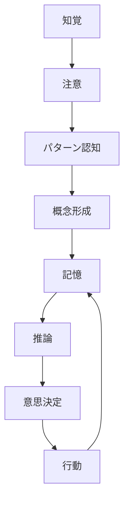
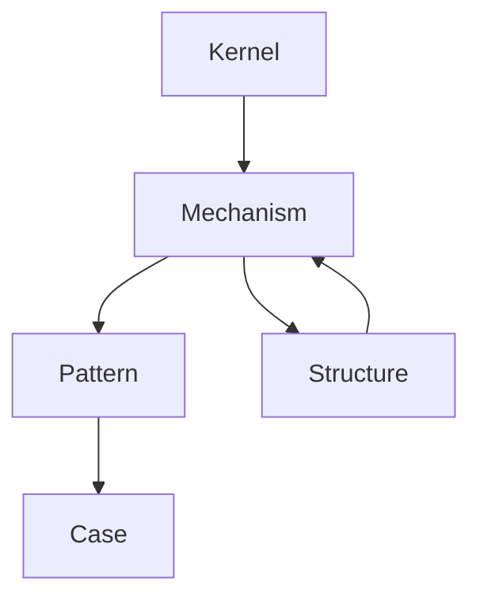

# 認知モデル Hub（Cognition Hub）

## ■ 定義
認知とは、外界および内的状態から情報を取得し、処理し、意味を構成し、行動選択へと接続する一連のプロセスである。

---

## ■ 全体構造（処理フロー）

---

## ■ レイヤー構造

### 1. Mechanism（処理）
- [[知覚処理メカニズム]]
- [[注意配分メカニズム]]
- [[パターン認知メカニズム]]
- [[概念形成メカニズム]]
- [[カテゴリ化メカニズム]]
- [[記憶符号化メカニズム]]
- [[記憶検索メカニズム]]
- [[02_zettelkasten/Zettelkasten Engine/01_knowledge/world_model/meta/mechanism/old/learning/学習メカニズム]]
- [[予測生成メカニズム]]
- [[推論メカニズム]]
- [[意思決定メカニズム]]
- [[メタ認知メカニズム]]

---

### 2. Structure（構造）
- [[知識構造]]
- [[スキーマ構造]]
- [[メンタルモデル]]
- [[注意構造]]
- [[記憶構造]]
- [[概念ネットワーク]]

---

### 3. Pattern（現象）
- [[ヒューリスティック]]
- [[02_zettelkasten/Zettelkasten Engine/01_knowledge/world_model/meta/model/human/congnition/認知バイアス]]
- [[錯覚]]
- [[直感判断]]
- [[ステレオタイプ]]
- [[02_zettelkasten/Zettelkasten Engine/01_knowledge/world_model/meta/model/human/congnition/フレーミング効果]]
- [[アンカリング]]
- [[利用可能性ヒューリスティック]]

---

### 4. Interface（接続）
- [[言語処理]]
- [[感情統合]]
- [[身体化認知]]
- [[社会的認知]]

---

## ■ Kernelとの接続（上位原理）

- [[02_zettelkasten/Zettelkasten Engine/01_knowledge/world_model/meta/model/human/congnition/予測処理原理]]
- [[情報圧縮原理]]
- [[02_zettelkasten/Zettelkasten Engine/01_knowledge/world_model/meta/model/social/constraints/注意資源制約]]
- [[02_zettelkasten/Zettelkasten Engine/01_knowledge/world_model/meta/model/human/learning/学習原理]]

---

## ■ 因果構造（抽象）

---

## ■ 設計原則

### 1. 認知は「流れ」で理解する
知覚 → 注意 → 認知 → 記憶 → 推論 → 意思決定

---

### 2. Patternは結果であり原因ではない
- バイアスはメカニズムの副産物

---

### 3. Structureは状態、Mechanismは変化
- 記憶構造 = 保存形式
- 記憶メカニズム = 書き込み/読み出し

---

### 4. Kernelが最上位の制約
- 認知は自由ではなく制約下で動く

---

## ■ 使用方法（運用ルール）

### 1. 新しい認知ノートを作るとき
- mechanism / structure / pattern のいずれかに分類する

---

### 2. caseを書くとき
- 必ずどのmechanismか紐づける

---

### 3. 分析するとき
- pattern → mechanism → kernel の順で遡る

---

## ■ Thinking Engineとの接続

- observation → 知覚
- attention → 注意
- interpretation → 概念形成
- reasoning → 推論
- decision → 意思決定

---

## ■ メタ構造

このHubは以下を担う：

- 認知の全体像の提示
- 各ノートへの導線
- 抽象レベルの統一

※ 実体は各フォルダに存在する