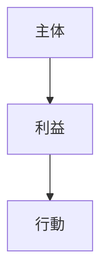

---
note_type: kernel
layer: kernel
kernel_type: constraint

---

# インセンティブ制約（Incentive Constraint）

主体は自分の利益に従って行動するという制約。

---

# 構造

---

# 結果

- [[02_zettelkasten/Zettelkasten Engine/01_knowledge/world_model/model/social/incentive/モラルハザード]]
- [[02_zettelkasten/Zettelkasten Engine/02_process/methods/analysis/代理人問題|代理人問題]]