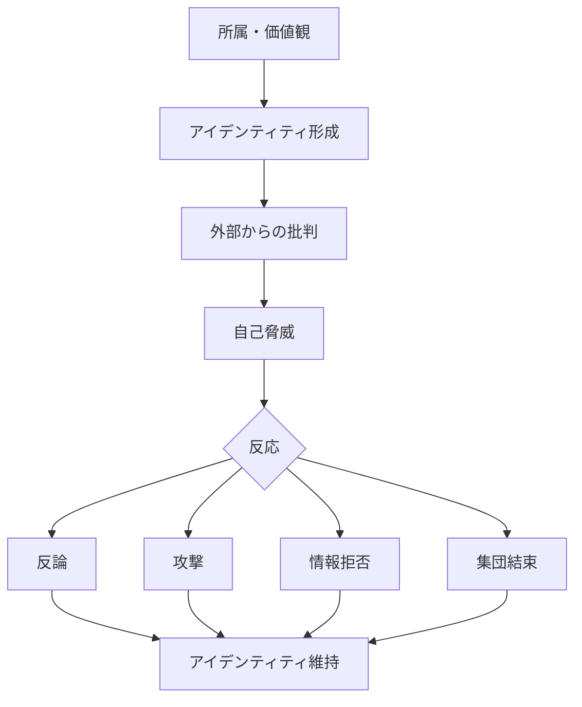

# アイデンティティ防衛パターン

人間は、自分が所属する集団や価値観を「自己の一部」として認識する。

そのため、それらが否定されると **自己そのものが攻撃されたと感じ、防衛反応が生じる。**

この反応を **アイデンティティ防衛パターン** と呼ぶ。

---

# パターン構造

---

# 説明

人は次のものを **自己の一部**として認識する。

- 国家
- 宗教
- 政党
- 職業
- 趣味コミュニティ
- 推し作品

そのため、それらへの批判は

**単なる意見ではなく自己への攻撃**

として認識されやすい。

---

# 典型的反応

## 防衛反論

例

- 「それは誤解だ」
- 「本当はそうではない」

---

## 攻撃

例

- 批判者への人格攻撃
- 相手集団の否定

---

## 情報拒否

例

- 不都合な情報を信じない
- メディア不信

---

## 集団結束

例

- 仲間内の団結強化
- 内集団バイアス

---

# 社会での例

政治

- 政党支持の固定化
- 政治的分極化

宗教

- 教義批判への強い反発

文化

- ファンダム論争
- 作品批判への過剰反応

国家

- ナショナリズム

---

# 特徴

アイデンティティ防衛は

- 信念修正を困難にする
- 集団対立を激化させる
- 情報分断を生む

という特徴を持つ。

---

# 関連

Structure  
[[02_zettelkasten/Zettelkasten Engine/01_knowledge/world_model/model/human/human/アイデンティティ形成原理]]

Kernel  
[[自己保存原理]]  
[[02_zettelkasten/Zettelkasten Engine/01_knowledge/world_model/meta/model/human/社会性原理]]  
[[02_zettelkasten/Zettelkasten Engine/01_knowledge/world_model/model/human/human/アイデンティティ形成原理]]

関連Pattern  

[[02_zettelkasten/Zettelkasten Engine/01_knowledge/world_model/meta/pattern/cognition/社会的同調パターン]]  
[[02_zettelkasten/Zettelkasten Engine/01_knowledge/world_model/meta/pattern/cognition/自己正当化パターン]]

Case  

[[政治的分極化]]  
[[宗教論争]]  
[[ファンダム対立]]