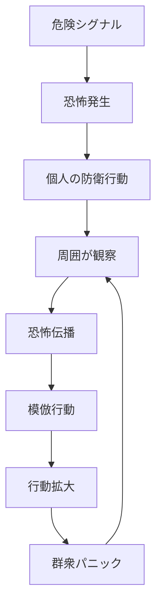

# パニックパターン

人間集団は、危険や不確実性を感じると恐怖が急速に伝播し、合理的判断よりも逃避・防衛行動が優先される。

この過程で行動は連鎖的に拡大し、集団全体が非合理的行動に向かう。

この現象を **パニックパターン** と呼ぶ。

---

# パターン構造



---

# 説明

危険や不確実性が高い状況では、

人間は

- 情報不足
- 判断時間不足
- 生存本能

のため、**周囲の行動を判断材料にする。**

その結果

```
誰かが逃げる
↓
他者が危険と判断
↓
逃避行動拡大
↓
群衆パニック
```

という連鎖が起きる。

---

# 典型的パターン

## 群衆パニック

例

- 事故時の群衆暴走
- スタンピード

---

## 経済パニック

例

- 銀行取り付け
- 株式市場暴落

---

## 情報パニック

例

- デマ拡散
- SNS炎上

---

# 発生条件

パニックは次の条件で起きやすい。

- 情報不足
- 不確実性
- 危険の可能性
- 集団密度
- 強い感情

---

# 特徴

パニックには次の性質がある。

- 感情伝染が速い
- 合理判断が弱まる
- 行動が連鎖的に増幅する
- 後から見ると過剰反応に見える

---

# 関連

Structure  
[[集団行動構造]]

Kernel  

[[恐怖回避原理]]  
[[02_zettelkasten/Zettelkasten Engine/01_knowledge/world_model/meta/model/human/社会性原理]]  
[[02_zettelkasten/Zettelkasten Engine/01_knowledge/world_model/meta/model/human/模倣原理]]

関連Pattern  

[[02_zettelkasten/Zettelkasten Engine/01_knowledge/world_model/meta/pattern/cognition/社会的同調パターン]]  
[[02_zettelkasten/Zettelkasten Engine/01_knowledge/world_model/meta/pattern/cognition/情報カスケードパターン]]

Case  

[[銀行取り付け]]  
[[株式市場パニック]]  
[[群衆事故]]