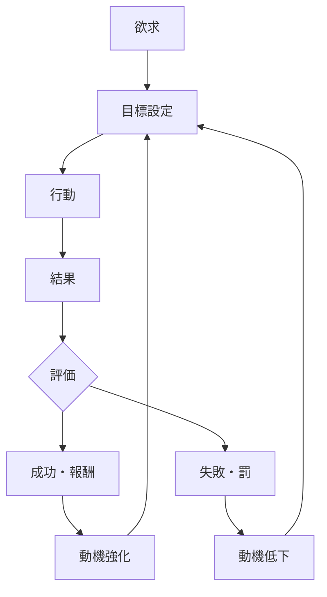

# 動機強化パターン

人間の動機は、行動の結果として得られる報酬によって強化または弱化する。

成功体験や報酬が繰り返されると、その行動への動機は増大し、行動頻度が上昇する。

この循環を **動機強化パターン** と呼ぶ。

---

# パターン構造

---

# 説明

人間の行動は次の循環で強化される。

1  
欲求が生まれる

2  
目標が設定される

3  
行動が行われる

4  
結果が評価される

5  
報酬または失敗により動機が変化する

この循環により

**成功体験は行動を加速させる。**

---

# 典型パターン

## 成功スパイラル

成功  
→ 自信  
→ 動機増大  
→ 行動増加  
→ さらなる成功

---

## 失敗スパイラル

失敗  
→ 自信低下  
→ 動機減少  
→ 行動減少  
→ さらなる失敗

---

# 社会での例

学習

- 成績向上 → 勉強意欲増大

ビジネス

- 売上成功 → 投資増加

スポーツ

- 勝利 → トレーニング意欲増加

SNS

- いいね → 投稿頻度増加

---

# 特徴

動機強化は

- 成功経験に強く依存する
- 初期成功が重要
- 環境のフィードバックに影響される

---

# 関連

Structure  
[[02_zettelkasten/Zettelkasten Engine/01_knowledge/world_model/model/human/learning/行動強化]]

Kernel  

[[02_zettelkasten/Zettelkasten Engine/01_knowledge/world_model/meta/model/human/欲求原理]]  
[[02_zettelkasten/Zettelkasten Engine/01_knowledge/world_model/meta/model/human/目標志向原理]]  

関連Pattern  

[[02_zettelkasten/Zettelkasten Engine/01_knowledge/world_model/meta/pattern/cognition/習慣形成パターン]]  
[[02_zettelkasten/Zettelkasten Engine/01_knowledge/world_model/meta/pattern/cognition/自己正当化パターン]]

Case  

[[SNS依存]]  
[[成功体験]]