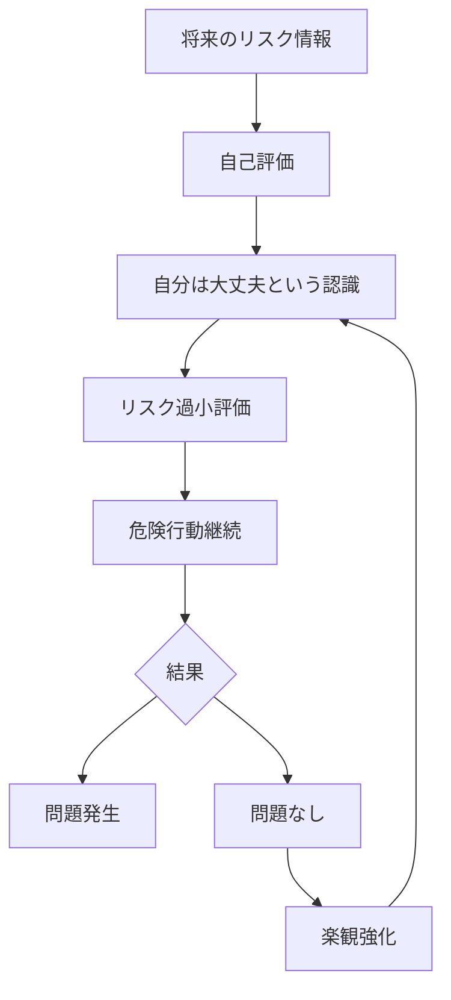

# 楽観バイアスパターン

人間は、自分にとって好ましい結果が起きる可能性を過大評価し、  
不利益や危険が起きる可能性を過小評価する傾向を持つ。

この傾向を **楽観バイアスパターン** と呼ぶ。

---

# パターン構造

---

# 説明

人間は心理的安定を保つために、

- 将来の成功確率
- 自分の能力
- 危険回避能力

を実際よりも高く評価する。

このため

「自分だけは大丈夫」

という認識が生まれる。

---

# 典型的パターン

## 個人的楽観

例

- 「事故は自分には起きない」
- 「自分は健康だから大丈夫」

---

## 成功過信

例

- 起業成功を過大評価
- 投資成功を信じる

---

## 危険軽視

例

- 安全対策を軽視
- 規則違反

---

# 社会での例

健康

- 喫煙リスクの軽視
- 生活習慣病対策の遅れ

投資

- バブル投資
- ハイリスク投資

起業

- 成功確率の過大評価

政策

- 戦争の楽観的予測

---

# 特徴

楽観バイアスは

- 個人の心理安定に寄与する
- リスク判断を歪める
- 成功経験で強化される

という特徴を持つ。

---

# 関連

Structure  
[[認知バイアス構造]]

Kernel  

[[02_zettelkasten/Zettelkasten Engine/01_knowledge/world_model/meta/model/human/congnition/限定合理性]]  
[[自己保存原理]]  
[[認知節約原理]]

関連Pattern  

[[02_zettelkasten/Zettelkasten Engine/01_knowledge/world_model/meta/pattern/cognition/過信パターン]]  
[[02_zettelkasten/Zettelkasten Engine/01_knowledge/world_model/meta/pattern/cognition/正常性バイアスパターン]]  
[[02_zettelkasten/Zettelkasten Engine/01_knowledge/world_model/meta/pattern/cognition/自己正当化パターン]]

Case  

[[投資バブル]]  
[[安全軽視]]