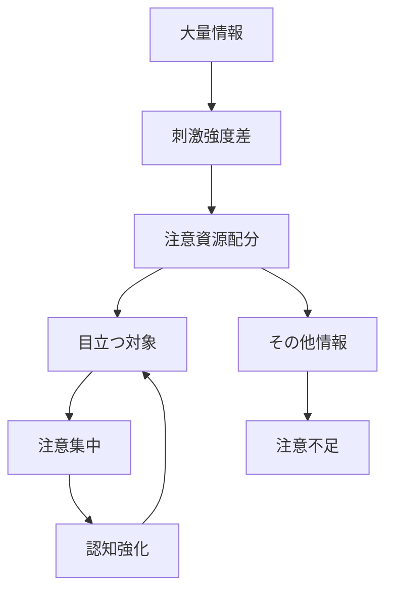

# 注意集中パターン

人間の注意資源は有限であるため、  
刺激の強い情報や目立つ情報に注意が集中しやすい。

その結果、少数の対象が過剰に注目され、  
他の情報は無視される傾向が生まれる。

この現象を **注意集中パターン** と呼ぶ。

---

# パターン構造



---

# 説明

人間の注意は次の特徴を持つ。

- 同時処理能力が低い
- 強い刺激に反応する
- 目立つ対象を優先する

そのため

```
強い刺激
↓
注意集中
↓
認知強化
```

という循環が起きる。

---

# 典型的パターン

## メディア集中

例

- 有名人スキャンダル
- 大事件

---

## SNSトレンド

例

- 炎上
- バズ投稿

---

## 広告

例

- 強いビジュアル
- 感情刺激

---

# 社会での例

政治

- 印象的事件の強調

メディア

- センセーショナル報道

マーケティング

- ブランド広告

SNS

- トレンド集中

---

# 特徴

注意集中は

- 目立つ対象を過大評価する
- 他の情報を見えにくくする
- 世論形成に影響する

という性質を持つ。

---

# 関連

Structure  
[[注意構造]]

Kernel  

[[02_zettelkasten/Zettelkasten Engine/01_knowledge/world_model/meta/model/social/constraints/注意資源制約]]  
[[認知節約原理]]

関連Pattern  

[[02_zettelkasten/Zettelkasten Engine/01_knowledge/world_model/meta/pattern/cognition/フレーミングパターン]]  
[[02_zettelkasten/Zettelkasten Engine/01_knowledge/world_model/meta/pattern/cognition/ナラティブ形成パターン]]  
[[02_zettelkasten/Zettelkasten Engine/01_knowledge/world_model/meta/pattern/cognition/情報カスケードパターン]]

Case  

[[SNSトレンド]]  
[[メディア報道]]