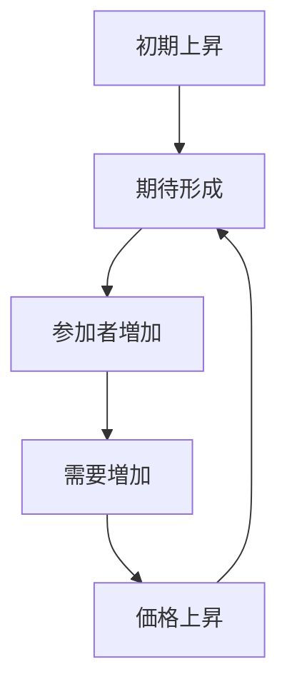

# バブルパターン

価格・評価・期待などが正のフィードバックによって自己強化され、実体的基盤を超えて過剰に膨張するダイナミクスを **バブルパターン** と呼ぶ。

---

# パターン構造

---

# 説明

バブルでは、価格上昇それ自体が「さらに上がる」という期待を生み、その期待が新たな参加者を呼び込む。

その結果、

- 実需より期待が支配的になる
- リスク認識が弱くなる
- 退出が遅れる

という特徴が現れる。

---

# 典型的局面

## 初期上昇

小さな上昇が注目される。

## 期待形成

上昇が継続すると信念が形成される。

## 参加拡大

他者の成功がさらなる参加を呼ぶ。

## 過熱

価格が実体から乖離する。

## 崩壊

期待が反転すると急落する。

---

# 社会での例

- 株式バブル
- 不動産バブル
- 仮想通貨バブル
- 人気銘柄の過熱

---

# 特徴

バブルは

- 正のフィードバックに依存する
- 情報カスケードと相性が良い
- 崩壊局面ではパニックに接続しやすい

---

# 関連

Structure  
[[増幅構造]]

Pattern  
[[02_zettelkasten/Zettelkasten Engine/01_knowledge/world_model/pattern/dynamics/mechanism/増幅パターン]]  
[[02_zettelkasten/Zettelkasten Engine/01_knowledge/world_model/pattern/dynamics/mechanism/フィードバックパターン]]  
[[02_zettelkasten/Zettelkasten Engine/01_knowledge/world_model/pattern/cognition/情報カスケードパターン]]  
[[02_zettelkasten/Zettelkasten Engine/01_knowledge/world_model/pattern/cognition/過信パターン]]

Case  
[[投資バブル]]