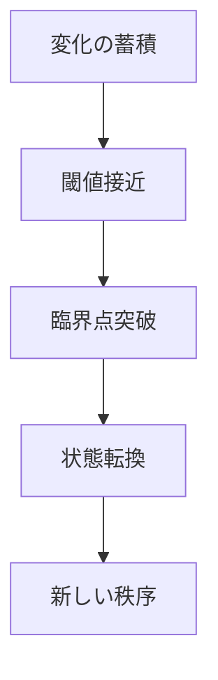

# 相転移パターン

システムが量的な蓄積を続けた結果、ある閾値を超えた瞬間に質的に異なる状態へ移行するダイナミクスを **相転移パターン** と呼ぶ。

---

# パターン構造

---

# 説明

相転移では、表面的には徐々に変化しているように見えても、ある点を境に性質そのものが変わる。

これは

- 量から質への転換
- 連続変化から不連続変化への移行

として理解できる。

---

# 典型的局面

## 蓄積

変化が目立たず進む。

## 接近

不安定性が高まる。

## 閾値突破

転換点を超える。

## 新秩序形成

別の安定状態に移る。

---

# 社会での例

- 政治体制転換
- 技術普及の普遍化
- 世論の一斉反転
- 都市の性格変化

---

# 特徴

相転移は

- 閾値の存在が重要
- 前段階では見えにくい
- 転換後は元に戻りにくいことがある

---

# 関連

Structure  
[[閾値構造]]

Pattern  
[[02_zettelkasten/Zettelkasten Engine/01_knowledge/world_model/pattern/dynamics/mechanism/臨界点パターン]]  
[[02_zettelkasten/Zettelkasten Engine/01_knowledge/world_model/pattern/dynamics/mechanism/適応パターン]]  
[[02_zettelkasten/Zettelkasten Engine/01_knowledge/world_model/pattern/dynamics/mechanism/ロックインパターン]]

Case  
[[政体転換]]