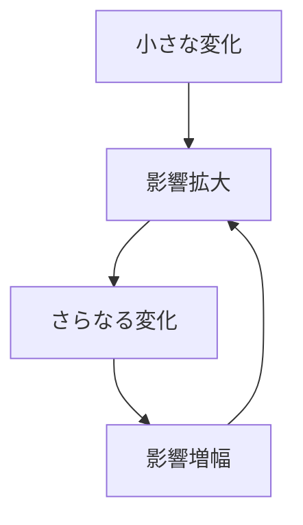

# 増幅パターン

小さな変化が連鎖的に強化され、大きな変化に発展するダイナミクスを増幅パターンと呼ぶ。

---

# パターン構造

---

# 例

- SNS拡散
- 投資バブル
- 人気商品

---

# 関連

[[02_zettelkasten/Zettelkasten Engine/01_knowledge/world_model/meta/pattern/dynamics/mechanism/フィードバックパターン]]  
[[02_zettelkasten/Zettelkasten Engine/01_knowledge/world_model/meta/pattern/dynamics/mechanism/カスケードパターン]]