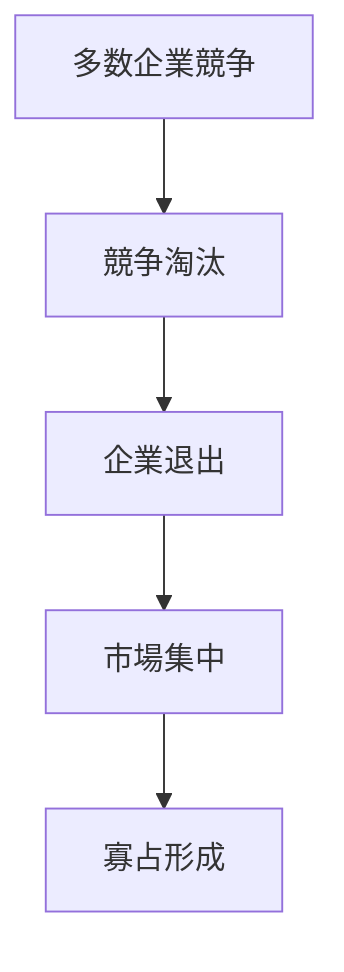

# 寡占形成パターン

競争市場において、時間の経過とともに少数企業へ市場シェアが集中し、寡占構造へ移行する典型的な市場パターン。

---

# パターン構造

---

# 説明

競争市場では、すべての企業が長期的に生き残るわけではない。

競争を通じて

- 技術力
- 資本力
- ブランド
- 規模

などで優位な企業が生き残り、企業数は徐々に減少する。

---

# 発生要因

## 規模の経済

大企業ほどコストが低くなる。

## ブランド優位

信頼が集中する。

## 技術格差

研究開発力の差。

## 参入障壁

新規参入が困難。

---

# 例

- 自動車産業
- 半導体産業
- 航空産業

---

# 関連

Structure  
[[02_zettelkasten/Zettelkasten Engine/01_knowledge/world_model/meta/pattern/market/structure/寡占構造]]  
[[02_zettelkasten/Zettelkasten Engine/01_knowledge/world_model/meta/pattern/market/structure/参入障壁構造]]

Dynamics  
[[02_zettelkasten/Zettelkasten Engine/01_knowledge/world_model/pattern/dynamics/mechanism/増幅パターン]]