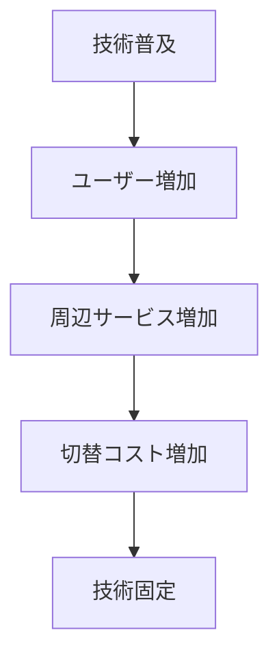

# 市場ロックインパターン

一度普及した技術・規格・プラットフォームが固定され、他の選択肢への移行が困難になる市場パターン。

---

# パターン構造

---

# 説明

ロックインでは

- ユーザー
- ソフトウェア
- インフラ

が既存技術に依存する。

その結果、新技術が優れていても普及しにくくなる。

---

# 例

- QWERTY配列
- Windows
- VHS

---

# 関連

Structure  
[[02_zettelkasten/Zettelkasten Engine/01_knowledge/world_model/pattern/market/structure/ネットワーク市場構造]]

Dynamics  
[[02_zettelkasten/Zettelkasten Engine/01_knowledge/world_model/pattern/dynamics/mechanism/ロックインパターン]]

Pattern  
[[02_zettelkasten/Zettelkasten Engine/01_knowledge/world_model/meta/pattern/market/pattern/勝者総取りパターン]]