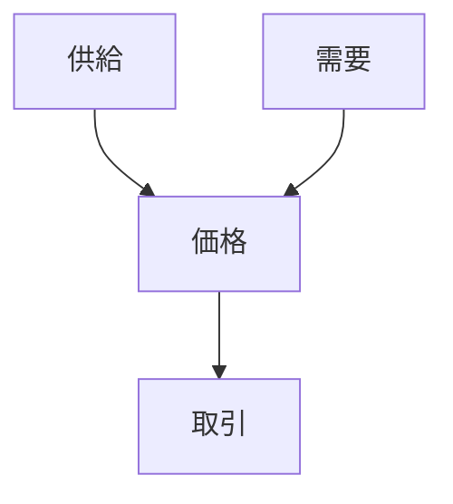

# 価格形成構造

価格形成とは、市場において財やサービスの価格が決定される過程の構造である。

価格は需要・供給・競争・情報などの要因によって決まる。

---

# 基本構造

---

# 主要要素

## 需要

消費者の購買意欲。

## 供給

企業が提供する量。

## 情報

価格や品質に関する情報。

## 競争

企業間の競争。

---

# 価格形成のタイプ

## 市場価格

需給で決まる価格。

## 管理価格

企業が設定する価格。

## 交渉価格

取引ごとに決まる価格。

---

# 関連

Structure  
[[02_zettelkasten/Zettelkasten Engine/01_knowledge/world_model/meta/pattern/market/structure/競争構造]]

Pattern  
[[02_zettelkasten/Zettelkasten Engine/01_knowledge/world_model/pattern/market/pattern/価格戦争パターン]]  
[[02_zettelkasten/Zettelkasten Engine/01_knowledge/world_model/pattern/dynamics/behavior/バブルパターン]]