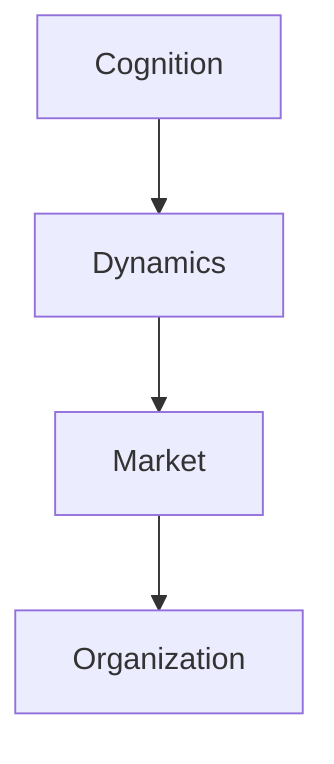
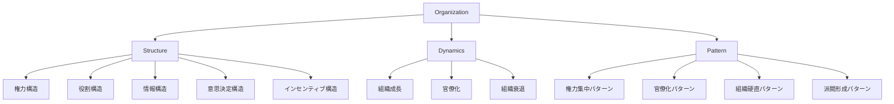

# Organization Hub

Organization は、人間が目的達成のために形成する協働構造である。

組織では

- 権力
- 役割
- 情報
- インセンティブ
- 文化

などが相互作用し、集団行動が形成される。

この Hub は組織構造・組織ダイナミクス・組織パターンを整理する入口である。

---

# 位置づけ

---

# 全体構造

---

# 読み順

## 最小ルート

1 [[02_zettelkasten/未整理/model 1/world_model/03_social/power/権力構造]]  
2 [[02_zettelkasten/Zettelkasten Engine/01_knowledge/world_model/meta/pattern/organization/structure/役割構造]]  
3 [[02_zettelkasten/Zettelkasten Engine/01_knowledge/world_model/meta/pattern/organization/structure/情報構造]]  
4 [[02_zettelkasten/Zettelkasten Engine/01_knowledge/world_model/meta/pattern/organization/structure/意思決定構造]]

---

## 組織問題ルート

1 [[02_zettelkasten/Zettelkasten Engine/01_knowledge/world_model/meta/pattern/organization/structure/情報構造]]  
2 [[02_zettelkasten/未整理/model 1/world_model/03_social/incentive/インセンティブ構造]]  
3 [[02_zettelkasten/Zettelkasten Engine/01_knowledge/world_model/meta/pattern/organization/pattern/behavior/官僚化パターン]]

---

# 関連

Structure  
[[02_zettelkasten/Zettelkasten Engine/01_knowledge/world_model/pattern/market/structure/市場ポジション構造]]  
[[02_zettelkasten/Zettelkasten Engine/01_knowledge/world_model/meta/pattern/market/dynamics/競争構造]]

Pattern  
[[02_zettelkasten/Zettelkasten Engine/01_knowledge/world_model/meta/pattern/organization/pattern/power/権力集中パターン]]  
[[02_zettelkasten/Zettelkasten Engine/01_knowledge/world_model/meta/pattern/organization/pattern/behavior/官僚化パターン]]