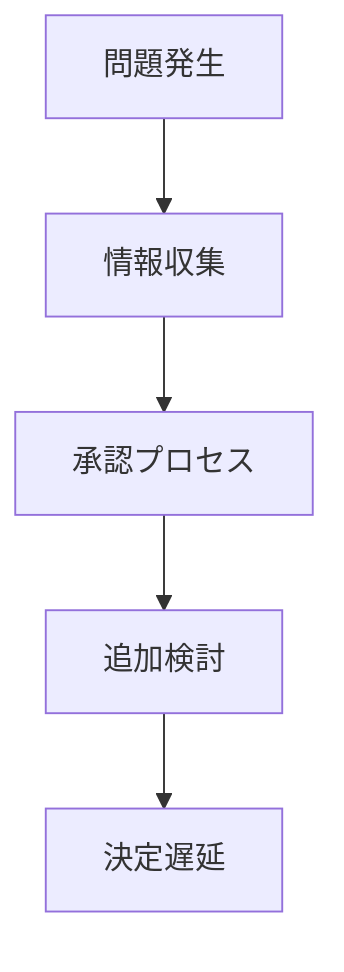

# 意思決定遅延パターン

組織内の意思決定が遅くなり、環境変化への対応が遅れる現象。

---

# パターン構造

---

# 発生要因

- 階層構造
- 官僚制
- 承認プロセス
- 情報不足

---

# 結果

- 市場機会喪失
- 危機対応失敗
- 組織競争力低下

---

# 例

- 大企業の新規事業失敗
- 政府の危機対応遅延

---

# 関連

Structure  
[[02_zettelkasten/Zettelkasten Engine/01_knowledge/world_model/meta/pattern/organization/structure/意思決定構造]]

Pattern  
[[02_zettelkasten/Zettelkasten Engine/01_knowledge/world_model/meta/pattern/organization/pattern/behavior/官僚化パターン]]  
[[02_zettelkasten/Zettelkasten Engine/01_knowledge/world_model/pattern/organization/pattern/information/サイロ化パターン]]