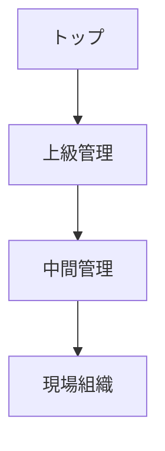
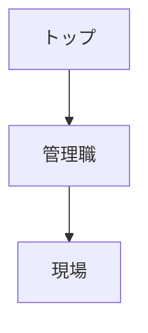
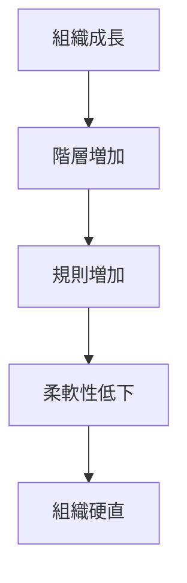

# 官僚制構造

官僚制構造とは、規則・階層・分業によって組織を運営する大規模組織の標準的な構造である。

この構造では、個人ではなく **役職と規則**が組織行動を決定する。

---

# 基本構造

---

# 官僚制の基本要素

## 階層構造

組織は階層的に構成される。

---

## 分業

組織は役割ごとに専門化される。

例

- 財務
- 人事
- 技術
- 営業

---

## 規則

組織は規則によって運営される。

特徴

- 手続き
- 文書
- 標準化

---

## 権限

役職に権限が付属する。

---

## 非人格性

意思決定は個人ではなく役職によって行われる。

---

# 官僚制のメリット

- 大規模組織の運営が可能
- 手続きの安定性
- 予測可能性
- 専門化

---

# 官僚制の問題

## 官僚化

組織が規則中心になり柔軟性を失う。

---

## 目的転倒

手続きが目的化する。

---

## 情報遅延

階層構造による情報伝達の遅れ。

---

# 官僚制ダイナミクス

---

# 適用される組織

官僚制は多くの大規模組織に見られる。

例

- 国家行政
- 大企業
- 軍隊
- 大学
- 宗教組織

---

# 関連

Structure

[[02_zettelkasten/Zettelkasten Engine/01_knowledge/world_model/meta/pattern/organization/structure/権力構造]]  
[[02_zettelkasten/Zettelkasten Engine/01_knowledge/world_model/meta/pattern/organization/structure/役割構造]]  
[[02_zettelkasten/Zettelkasten Engine/01_knowledge/world_model/meta/pattern/organization/structure/情報構造]]  
[[02_zettelkasten/Zettelkasten Engine/01_knowledge/world_model/meta/pattern/organization/structure/意思決定構造]]  
[[02_zettelkasten/Zettelkasten Engine/01_knowledge/world_model/meta/pattern/organization/structure/代理問題構造]]

Pattern

[[02_zettelkasten/Zettelkasten Engine/01_knowledge/world_model/pattern/organization/pattern/behavior/官僚化パターン]]  
[[02_zettelkasten/Zettelkasten Engine/01_knowledge/world_model/pattern/organization/pattern/behavior/組織硬直パターン]]

Hub

[[02_zettelkasten/Zettelkasten Engine/01_knowledge/world_model/pattern/organization/Organization_Pattern_Hub]]