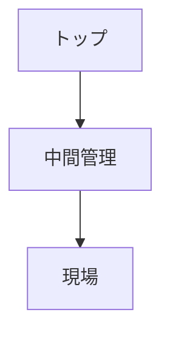

# 権力構造

権力構造とは、組織において意思決定や資源配分を左右する影響力の配置構造である。

---

# 基本構造

---

# 権力の源泉

- 地位
- 資源
- 情報
- 専門知識
- ネットワーク

---

# 関連

[[02_zettelkasten/Zettelkasten Engine/01_knowledge/world_model/meta/pattern/organization/structure/意思決定構造]]  
[[02_zettelkasten/Zettelkasten Engine/01_knowledge/world_model/meta/pattern/organization/structure/情報構造]]