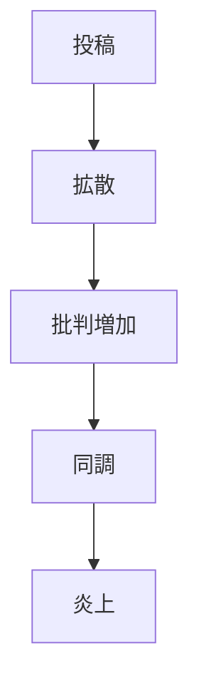

# 炎上

炎上とは、SNSやオンラインコミュニティにおいて特定の人物・発言・行動に対する批判や攻撃が急速に拡散し、集団的な非難状態になる現象。

---

# 基本構造

---

# 特徴

- 急速な拡散
- 同調圧力
- 道徳的非難
- 個人攻撃

---

# 関連パターン

[[02_zettelkasten/Zettelkasten Engine/01_knowledge/world_model/pattern/cognition/情報カスケードパターン]]  
[[02_zettelkasten/Zettelkasten Engine/01_knowledge/world_model/pattern/social/pattern/分極化パターン]]  
[[02_zettelkasten/Zettelkasten Engine/01_knowledge/world_model/pattern/social/pattern/排除パターン]]