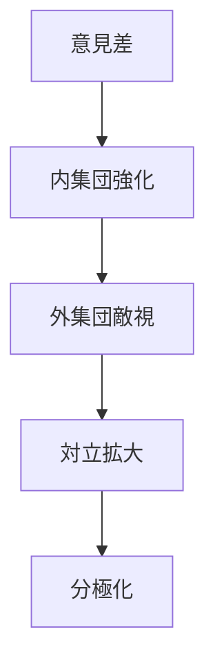

# 分極化パターン

社会の意見や集団が中間を失い、相互に遠ざかって対立的な二極へ分かれていくパターン。

---

# パターン構造

---

# 特徴

- 中間層が弱まる
- 対話が難しくなる
- アイデンティティ対立化する

---

# 関連

[[02_zettelkasten/Zettelkasten Engine/01_knowledge/world_model/pattern/social/structure/集団対立構造]]  
[[02_zettelkasten/Zettelkasten Engine/01_knowledge/world_model/pattern/cognition/社会的同調パターン]]