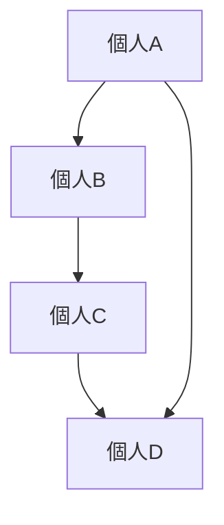

# 社会関係構造

社会関係構造とは、個人や集団が相互に結ぶ関係の配置構造である。

社会は孤立した個人の集合ではなく、関係の網の目として存在する。

---

# 基本構造

---

# 関係の種類

## 血縁

家族・親族関係。

## 地縁

地域共同体。

## 職縁

職業・組織関係。

## 趣縁

趣味・関心共同体。

---

# 特徴

- 社会資本を形成する
- 情報流通の経路になる
- 集団形成の基盤になる

---

# 関連

[[02_zettelkasten/Zettelkasten Engine/01_knowledge/world_model/meta/pattern/social/structure/集団構造]]  
[[02_zettelkasten/Zettelkasten Engine/01_knowledge/world_model/meta/pattern/social/structure/社会統合構造]]