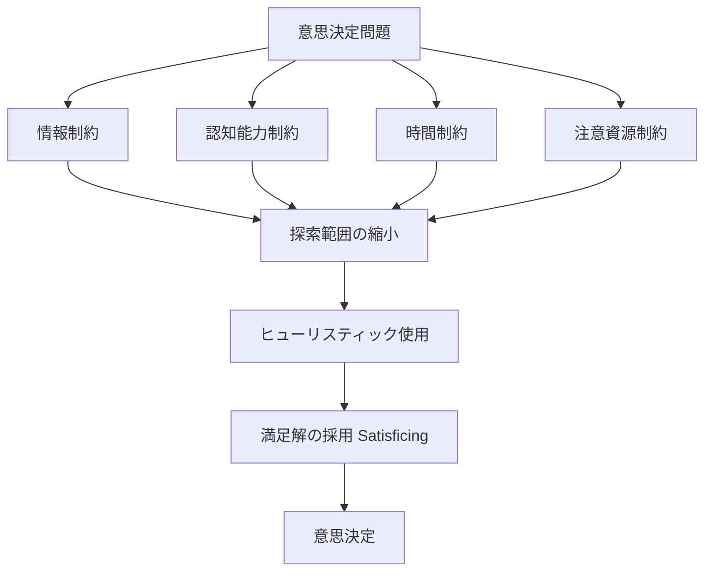
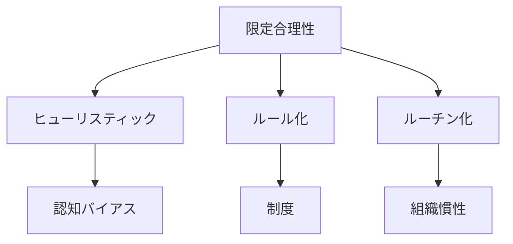

# 限定合理性（Bounded Rationality）

限定合理性とは、人間の意思決定が  
**情報・計算能力・時間・注意資源の制約の下で行われる構造**である。

人間は理論上の「完全合理的主体（Homo economicus）」のように  
全情報を比較して最適解を選ぶことはできない。

その代わりに人間は

- 不完全な情報
- 限られた認知能力
- 限られた時間

の中で **十分に満足できる解（satisficing）** を選択する。

この構造は意思決定の多くの歪み・バイアスの基礎原因となる。

---

# 基本構造

---
# 構造要素

## 1 情報制約

人間は、
- 情報を完全には入手できない    
- 未来を完全には予測できない    

例
- 市場情報の不足    
- 他者の意図の不明    
- 環境の不確実性    

---

## 2 認知能力制約

人間の脳には、
- 記憶容量    
- 計算能力    
- 推論能力    
の限界がある。

そのため、
- 全選択肢の評価    
- 完全な期待値計算    
は不可能である。

---

## 3 時間制約

現実の意思決定は、
- 締切    
- リアルタイム判断    
- 行動の必要性    
によって時間が制約される。

例
- 経営判断    
- 軍事判断    
- 運転判断    

---

## 4 注意資源制約

人間の注意は有限である。
- 同時処理可能な対象は少ない    
- 注意の配分は偏る    

結果、
- 重要情報を見落とす    
- 目立つ情報に引きずられる    

---

# 行動パターン

制約の結果、人間は以下の戦略を取る。

## ヒューリスティック

簡易判断ルール

例
- 代表性ヒューリスティック    
- 利用可能性ヒューリスティック    
- アンカリング    

---

## 満足化（Satisficing）

最適解ではなく、十分に良い解が見つかった時点で探索を終了する。

---

## 探索停止

探索コストが利益を上回ると探索をやめる。

---

# 結果として発生する現象

限定合理性は以下を生む。
- 認知バイアス    
- 組織の非合理性    
- 制度の慣性    
- ルーチン化    

---

# 社会構造への拡張

限定合理性は個人だけでなく

**組織・制度にも現れる**

例
- 官僚制    
- 企業ルーチン    
- 規則依存

---# Kernelとの接続

限定合理性は次のKernelと強く結びつく。

- [[02_zettelkasten/Zettelkasten Engine/01_knowledge/world_model/model/social/constraints/情報制約]]    
- [[02_zettelkasten/Zettelkasten Engine/01_knowledge/world_model/academic/principles/注意資源制約]]    
- [[探索コスト]]    
- [[インセンティブ]]    

---

# 要点

限定合理性とは、人間は最適化ではなく制約下で満足解を選ぶ存在であるという意思決定構造である。
