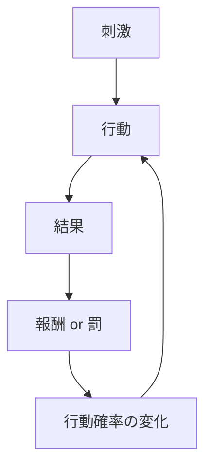
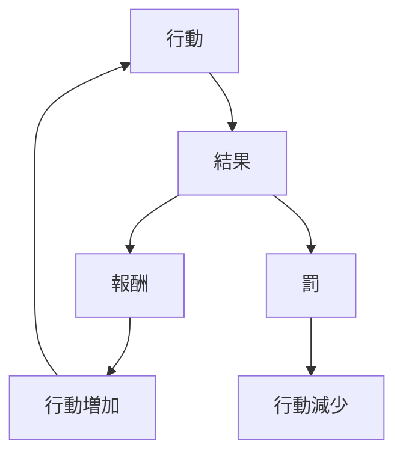

# 行動強化構 
Behavior Reinforcement

行動強化構造とは、 行動の結果が次の行動の発生確率を変化させる心理メカニズムである。
心理学では主に 行動主義（behaviorism）と学習理論の中核概念。

---

# 基本構造

---

# 強化の種類
## 正の強化（positive reinforcement）

望ましい結果が与えられる。

例
- 報酬    
- 褒められる    
- 金銭    

結果：行動が増える

---

## 負の強化（negative reinforcement）

不快な状態が除去される。

例
- 痛みがなくなる    
- 問題が解決する    
- 義務が減る    

結果：行動が増える

---

## 罰（punishment）

不快な結果が与えられる。

例
- 叱責    
- 罰金    
- 損失    

結果：行動が減る

---

## 消去（extinction）

行動に対する結果がなくなる。

例
- 無視    
- 反応なし    

結果：行動が減少する

---

# 強化スケジュール

行動の維持には報酬の与え方（スケジュール）が重要。

## 固定比率

一定回数で報酬

例
- 営業インセンティブ

---

## 変動比率

ランダム回数で報酬

例
- ギャンブル
- SNS通知

最も強力な強化

---

## 固定間隔

一定時間ごと

例
- 月給

---

## 変動間隔

ランダム時間

例
- メールチェック

---

# 行動強化の実際の循環

# 他構造との関係

行動強化は次の構造の基盤。
- [[02_zettelkasten/Zettelkasten Engine/01_knowledge/world_model/model/human/learning/習慣ループ]]    
- [[オペラント条件づけ]]    
- [[欲求構造]]    
- [[内発的動機]]    
- [[外発的動機]]    

---

# 重要原理

### 即時報酬原理

人間は、遅い報酬より即時報酬を強く学習する。

---

### 変動報酬原理

ランダム報酬は行動を最も強く固定する。

例

- SNS    
- ゲーム    
- ギャンブル    

---

### 報酬予測誤差

- 予想より良い結果  
→ 強化

- 予想より悪い結果  
→ 弱化

---

# 要約

行動強化構造

行動  
↓  
結果  
↓  
報酬 / 罰  
↓  
行動確率変化  
↓  
次の行動