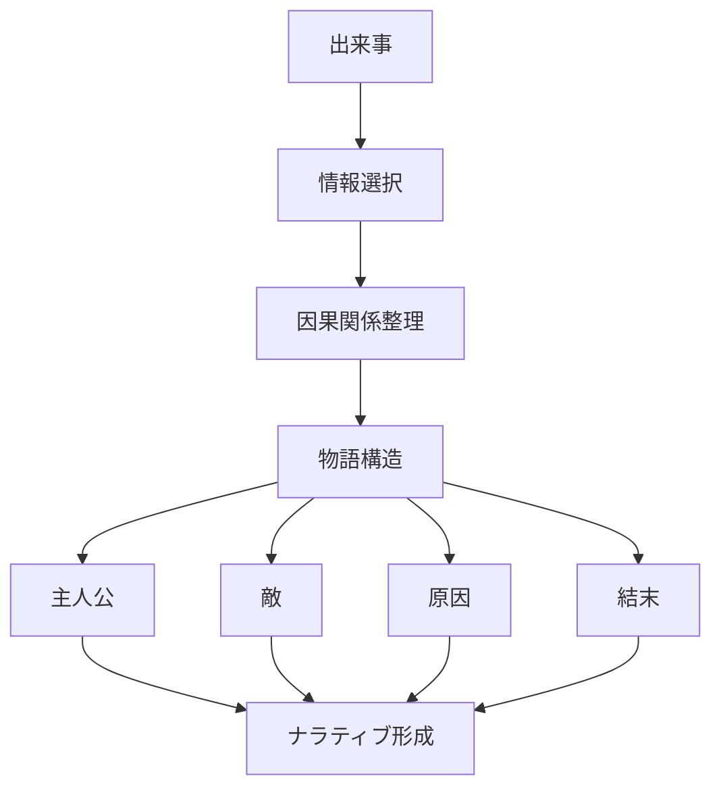

# ナラティブ形成パターン

人間は複雑な出来事を理解する際、  
出来事を因果関係を持つ物語として整理する傾向がある。

この過程で、出来事は

- 主人公
- 敵
- 原因
- 結末

を持つ **ナラティブ（物語）**として構築される。

この現象を **ナラティブ形成パターン** と呼ぶ。

---

# パターン構造



---

# 説明

現実は複雑で偶然も多いが、人間はそれを

- 理解
- 記憶
- 共有

するために **物語として整理する。**

その結果

```
出来事
↓
原因
↓
結果
```

という **単純なストーリー**が作られる。

---

# 典型的パターン

## 英雄物語

例

- 成功者のストーリー

---

## 陰謀物語

例

- 陰謀論

---

## 犠牲者物語

例

- 社会的不正

---

# 社会での例

政治

- 国家物語
- 政治プロパガンダ

歴史

- 国家史観

SNS

- 炎上ストーリー

メディア

- 分かりやすいニュース構造

---

# 特徴

ナラティブは

- 理解を容易にする
- 感情を動かす
- 情報を単純化する

という効果を持つ。

---

# 関連

Structure  
[[フレーミング構造]]

Kernel  

[[02_zettelkasten/Zettelkasten Engine/01_knowledge/world_model/model/human/物語化原理]]  
[[認知節約原理]]

関連Pattern  

[[02_zettelkasten/Zettelkasten Engine/01_knowledge/world_model/pattern/cognition/フレーミングパターン]]  
[[02_zettelkasten/Zettelkasten Engine/01_knowledge/world_model/pattern/cognition/確証バイアスパターン]]

Case  

[[政治プロパガンダ]]  
[[02_zettelkasten/Zettelkasten Engine/01_knowledge/world_model/pattern/social/case/陰謀論]]