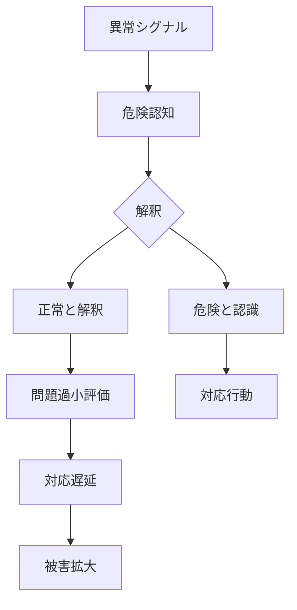

# 正常性バイアスパターン

人間は、危険な状況や異常な出来事に直面しても  
「状況は大きく変わっていない」「問題は深刻ではない」  
と解釈する傾向を持つ。

この傾向により、危険の兆候が過小評価され、対応が遅れる。

この現象を **正常性バイアスパターン** と呼ぶ。

---

# パターン構造

---

# 説明

突然の危険や異常に直面すると、人間は心理的ショックを受ける。

そのため脳は

- 不安軽減
- 心理的安定
- 認知負荷低減

のために

**「状況はまだ正常である」**

という解釈を優先する。

その結果、危機への対応が遅れる。

---

# 典型的パターン

## 危険過小評価

例

- 「まだ大丈夫」
- 「大したことはない」

---

## 行動遅延

例

- 避難が遅れる
- 対策を後回しにする

---

## 警告無視

例

- 専門家の警告を軽視
- 危険情報の否定

---

# 社会での例

災害

- 津波避難の遅れ
- 火災時の避難遅延

事故

- 原発事故
- 航空事故

企業

- 不正の放置
- 経営危機の見逃し

国家

- 戦争危機の軽視
- 軍事侵攻の過小評価

---

# 特徴

正常性バイアスは

- 突然の危機で発生しやすい
- 初期段階で強く働く
- 集団でも共有される

という特徴を持つ。

---

# 関連

Structure  
[[認知バイアス構造]]

Kernel  

[[02_zettelkasten/Zettelkasten Engine/01_knowledge/world_model/academic/principles/限定合理性]]  
[[自己保存原理]]  
[[恐怖回避原理]]

関連Pattern  

[[02_zettelkasten/Zettelkasten Engine/01_knowledge/world_model/pattern/cognition/過信パターン]]  
[[02_zettelkasten/Zettelkasten Engine/01_knowledge/world_model/pattern/cognition/自己正当化パターン]]  
[[02_zettelkasten/Zettelkasten Engine/01_knowledge/world_model/pattern/cognition/パニックパターン]]

Case  

[[津波避難遅れ]]  
[[原発事故]]