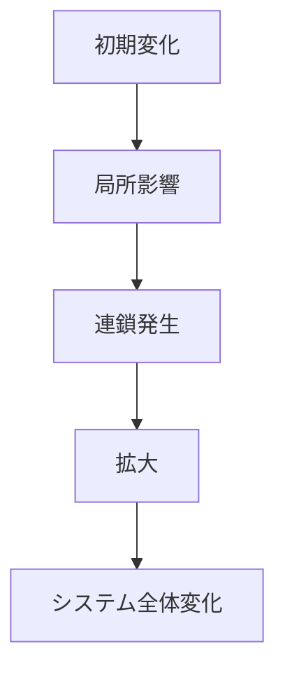

# カスケードパターン

ある変化が次々と他の要素に伝播し、連鎖的にシステム全体へ広がる現象をカスケードと呼ぶ。

---

# パターン構造

---

# 例

- 金融危機
- 停電連鎖
- 銀行破綻

---

# 関連

[[02_zettelkasten/Zettelkasten Engine/01_knowledge/world_model/pattern/dynamics/mechanism/増幅パターン]]  
[[02_zettelkasten/Zettelkasten Engine/01_knowledge/world_model/pattern/dynamics/mechanism/臨界点パターン]]