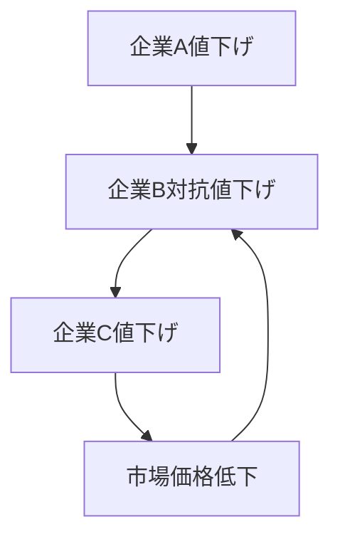

# 価格戦争パターン

企業が市場シェア獲得のために価格を引き下げ続け、競争が価格中心に激化するパターン。

---

# パターン構造

---

# 説明

価格戦争では、企業は競争に遅れないために値下げを続ける。

その結果

- 利益率低下
- 企業退出
- 市場再編

が起こる。

---

# 発生条件

- 製品差別化が弱い
- 参入企業が多い
- 成熟市場

---

# 結果

- 市場集中
- 寡占化
- 企業統合

---

# 関連

Structure  
[[02_zettelkasten/Zettelkasten Engine/01_knowledge/world_model/pattern/market/dynamics/競争構造]]

Pattern  
[[02_zettelkasten/Zettelkasten Engine/01_knowledge/world_model/pattern/market/pattern/寡占形成パターン]]

Dynamics  
[[02_zettelkasten/Zettelkasten Engine/01_knowledge/world_model/pattern/dynamics/mechanism/増幅パターン]]