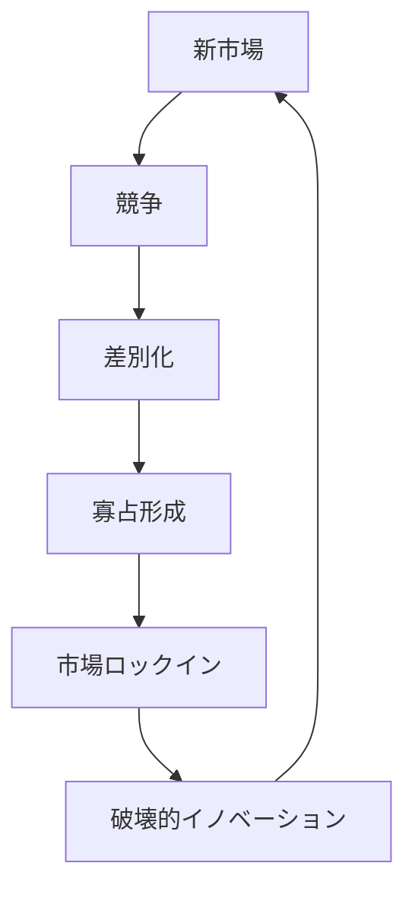
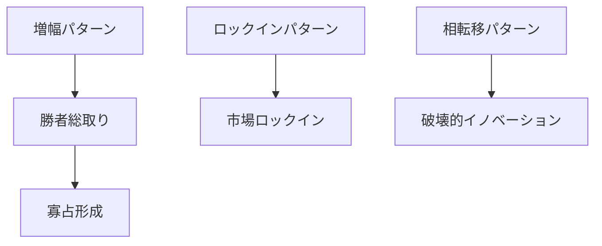
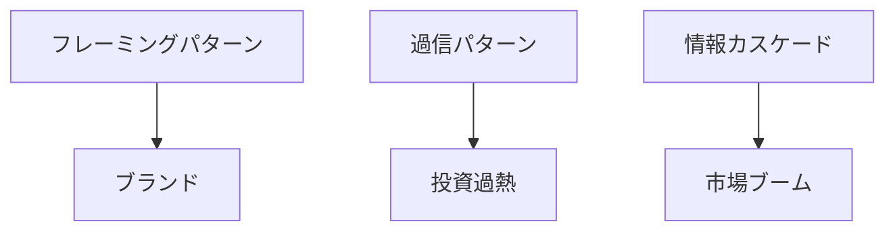

# 市場進化パターン

市場進化パターンとは、市場が時間の経過とともに  
**競争 → 集中 → 固定 → 破壊 → 再競争**  
という循環を繰り返すダイナミクスである。

多くの産業では、市場は静的ではなく、一定の進化パターンを示す。

---

# 基本構造

---

# 1 新市場

技術革新や制度変化によって新しい市場が生まれる。

特徴

- 参入企業が多い
- 競争が激しい
- 技術が未成熟

---

# 2 競争

多数の企業が市場シェアを争う。

主な競争手段

- 価格
- 技術
- サービス
- ブランド

---

# 3 差別化

企業は単純な価格競争から脱出するために差別化を行う。

差別化要素

- 技術
- ブランド
- デザイン
- エコシステム

---

# 4 寡占形成

競争の淘汰により企業数が減少し、市場は少数企業へ集中する。

特徴

- 市場シェア集中
- 高い参入障壁
- 技術・ブランド優位

---

# 5 市場ロックイン

技術・規格・ネットワーク効果により市場構造が固定される。

特徴

- 新規参入が困難
- 技術標準固定
- エコシステム形成

---

# 6 破壊的イノベーション

新しい技術やビジネスモデルが既存市場を破壊する。

特徴

- 低価格
- 新市場
- 新技術

その結果

- 既存企業の優位が崩れる
- 市場が再び競争状態になる

---

# 典型例

## IT産業

PC  
→ Windows支配  
→ スマートフォン革命

## 映像メディア

VHS  
→ DVD  
→ ストリーミング

## 交通

馬車  
→ 自動車  
→ EV

---

# Dynamicsとの接続

---

# Cognitionとの接続

---

# 関連

Structure  
[[02_zettelkasten/Zettelkasten Engine/01_knowledge/world_model/pattern/market/dynamics/競争構造]]  
[[02_zettelkasten/Zettelkasten Engine/01_knowledge/world_model/pattern/market/structure/寡占構造]]  
[[02_zettelkasten/Zettelkasten Engine/01_knowledge/world_model/pattern/market/structure/ネットワーク市場構造]]

Pattern  
[[02_zettelkasten/Zettelkasten Engine/01_knowledge/world_model/pattern/market/pattern/寡占形成パターン]]  
[[02_zettelkasten/Zettelkasten Engine/01_knowledge/world_model/pattern/market/pattern/差別化パターン]]  
[[02_zettelkasten/Zettelkasten Engine/01_knowledge/world_model/pattern/market/pattern/市場ロックインパターン]]

Dynamics  
[[02_zettelkasten/Zettelkasten Engine/01_knowledge/world_model/pattern/dynamics/mechanism/増幅パターン]]  
[[02_zettelkasten/Zettelkasten Engine/01_knowledge/world_model/pattern/dynamics/mechanism/ロックインパターン]]  
[[02_zettelkasten/Zettelkasten Engine/01_knowledge/world_model/pattern/dynamics/behavior/相転移パターン]]

---

# メモ

市場進化パターンは、多くの産業で観察される **市場ライフサイクルの基本モデル**である。

このパターンを理解すると

- 産業分析
- 競争戦略
- 技術革新
- 投資判断

を体系的に理解できる。