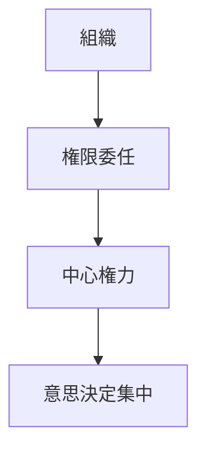

# 権力集中パターン

組織の意思決定権が少数の人物または中心組織に集中するパターン。

---

# パターン構造

---

# 発生要因

- 組織成長
- 危機対応
- カリスマリーダー
- 官僚化

---

# 例

- CEO中心経営
- 強い大統領制
- 軍司令部集中

---

# 関連

Structure  
[[02_zettelkasten/Zettelkasten Engine/01_knowledge/world_model/pattern/organization/structure/権力構造]]

Pattern  
[[02_zettelkasten/Zettelkasten Engine/01_knowledge/world_model/pattern/organization/pattern/behavior/官僚化パターン]]