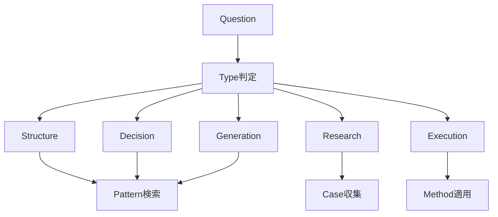

# ■ 1. Question Routing Engine（中核ノート）

# Question Routing Engine

## 0. 目的
問いを適切な処理経路へ分岐させることで、
- 無駄な試行
- 誤った抽象度
- パターン未活用
を防ぐ

---

## 1. 入力
- [[LLM Input Layer]]
- Question
- Context（任意）
- Constraints（任意）

---

## 2. 出力
- [[template Hub]]
- [[LLM Output Layer]]
- [[Problem Type]]
- Required Modules
- Next Action

---

## 3. Problem Type分類（一次判定）

以下のいずれかに必ず分類する：

### ① Structure Problem（構造問題）
- なぜ起きているか？
- 全体構造を理解したい
- ボトルネックはどこか

👉 出力：
- Structure分析（[[Structure Hub]]）
- Mechanism特定（[[02_zettelkasten/Zettelkasten Engine/02_knowledge/world_model/mechanism/Mechanism Hub|Mechanism Hub]]）

---

### ② Decision Problem（意思決定問題）
- どれを選ぶべきか？
- 方針を決めたい
- トレードオフがある

👉 出力：
- Solution生成（[[02_zettelkasten/90_template/Solution テンプレート|Solution テンプレート]]）
- Decision評価（[[Decision Note Template]]）

---

### ③ Generation Problem（生成問題）
- 何を作るべきか？
- アイデアが欲しい

👉 出力：
- Pattern検索
- Solution生成

---

### ④ Research Problem（探索問題）
- 分からない
- 仮説がない

👉 出力：
- Research開始
- Case収集

---

### ⑤ Execution Problem（実行問題）
- どう実行するか？
- 手順が欲しい

👉 出力：
- [[Execution Policy]]
- Method適用

---

## 4. 判定ルール（実装）

### Step1：キーワード判定

| キーワード | Type |
|------------|------|
| なぜ / 構造 / 原因 | Structure |
| どれ / 選ぶ / 判断 | Decision |
| 作る / アイデア | Generation |
| 分からない / 調べる | Research |
| 実行 / 手順 | Execution |

---

### Step2：強制補正

- 選択肢がある → Decision優先
- 未知が大きい → Research優先
- 既存解がありそう → Pattern経由

---

## 5. ルーティング結果テンプレ

```markdown
# Routing Result

## Problem Type
- 

## Required Modules
- Pattern
- Mechanism
- Solution
- Decision

## Next Actions
1.
2.
3.
```
---

## 6. 実行フロー



---

## 7. 強制ルール

- Pattern検索を必ず通す    
- Decision Problemは必ずDecisionへ    
- Execution ProblemはDecisionを経由する    

---

## 8. 失敗パターン

❌ RoutingせずにSolutionへ直行  
❌ Patternを使わない  
❌ Decisionを飛ばす

---

## 9. 連携ノート

- [[Intent Interpretation]]    
- [[Mode Selection]]    
- [[Task Routing]]    
- [[Pattern Library]]    
- [[Solution Generation Engine]]    
- [[Decision Note Template]]    

---

## 10. 一行定義

> Routing = 「問いを正しい抽象レイヤーに送る装置」
> 
---

# ■ 2. Kernel Routing辞書（重要）

| 問題タイプ | Kernel                                                                                                                                  |
| ----- | --------------------------------------------------------------------------------------------------------------------------------------- |
| 不足    | [[02_zettelkasten/Zettelkasten Engine/02_knowledge/world_model/kernel/physics/拡散原理\|拡散原理]] / [[選択原理]]                                                                 |
| 過剰    | [[制約原理]] / [[02_zettelkasten/Zettelkasten Engine/02_knowledge/world_model/kernel/physics/平衡化原理\|平衡化原理]]                                                               |
| 非対称   | [[情報原理]] / [[02_zettelkasten/Zettelkasten Engine/02_knowledge/world_model/meta/kernel/complex/ネットワーク原理\|ネットワーク原理]]                                                    |
| 断絶    | [[02_zettelkasten/Zettelkasten Engine/02_knowledge/world_model/kernel/complex/ネットワーク原理\|ネットワーク原理]]                                                                    |
| ロックイン | [[非線形性]] / [[02_zettelkasten/Zettelkasten Engine/02_knowledge/world_model/kernel/evolution/進化原理\|進化原理]]                                                               |
| 非効率   | [[02_zettelkasten/Zettelkasten Engine/02_knowledge/world_model/kernel/physics/フィードバック原理\|フィードバック原理]] / [[02_zettelkasten/Zettelkasten Engine/02_knowledge/world_model/mechanism/decision/最適化\|最適化]] |
| 不信    | [[情報原理]] / [[02_zettelkasten/Zettelkasten Engine/02_knowledge/world_model/meta/model/social/institution/制度原理\|制度原理]]                                                  |
| 不確実性  | [[02_zettelkasten/Zettelkasten Engine/02_knowledge/world_model/kernel/evolution/進化原理\|進化原理]] / [[02_zettelkasten/Zettelkasten Engine/02_knowledge/world_model/meta/kernel/evolution/適応\|適応]]        |

---

# ■ 3. Kernel → Mechanism辞書

| Kernel  | Mechanism      |
| ------- | -------------- |
| フィードバック | 強化 / 安定化       |
| ネットワーク  | 接続 / ハブ / クラスタ |
| 非線形     | 増幅 / 崩壊        |
| 平衡      | 調整 / 均衡化       |
| 拡散      | 伝播 / 浸透        |
| 選択      | フィルタ / 競争      |
| 進化      | 適応 / 変異        |
| 制約      | 制限 / 上限        |

---

