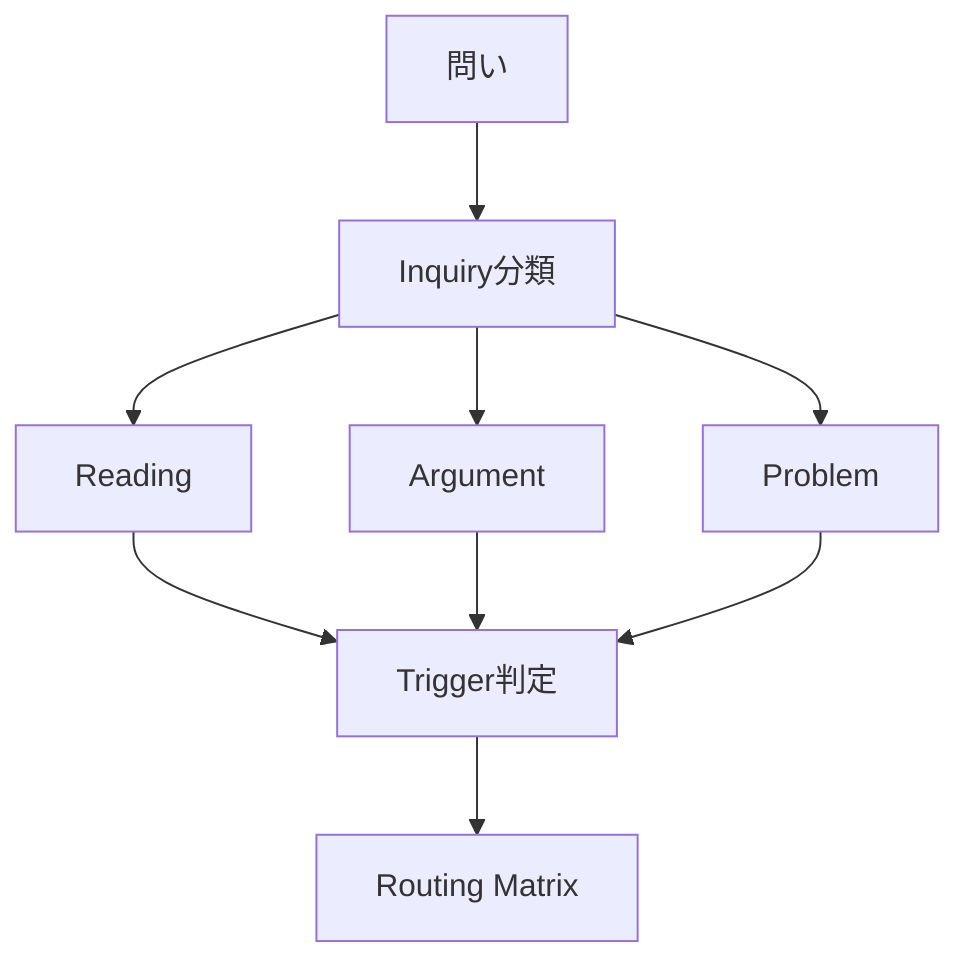

# Summary
問い（Inquiry）を分類し、適切な思考ルートへ接続するハブ

---

# Description
Inquiryは思考OSの入口であり、問いの種類によって  
- 参照する知識
- 推論の方法
- 出力形式  
が変わる

本Hubは問いを3分類し、Routing前の分岐を制御する

---

# Structure

## Inquiry Types
- Reading
- Argument
- Problem

---

# Dynamics / Mechanism

## 全体フロー

---

# 各タイプの分岐ロジック
## Reading Inquiry
- 入力：テキスト・事象
- 目的：理解・構造化
- 特徴：解釈中心
既存知識との接続
→ Structure / Mechanism寄りにルーティング

## Argument Inquiry
- 入力：主張・意見
- 目的：妥当性検証
- 特徴：前提検証
論理チェック
→ Mechanism / Kernel寄りにルーティング

## Problem Inquiry
- 入力：課題・目標
- 目的：解決
- 特徴：制約あり
実行志向
→ Trigger / Transitionからルーティング

# Structure Mapping

## Reading Inquiry
- [[知識抽出構造]]
- [[読書解釈構造]]
- [[読書手順構造]]
- [[読書統合構造]]
- [[読書評価構造]]
- [[読書目的構造]]
- [[論証構造]]
- [[文章構造]]

## Argument Inquiry
- [[議論構造]]
- [[推論構造]]
- [[接続関係構造]]
- [[命題構造]]
- [[論証評価構造]]
- [[論理展開構造]]
## Problem Inquiry
- [[問題定義構造]]
- [[02_zettelkasten/Zettelkasten Engine/01_system/thinking_engine/02_inquiry/structure/problem/仮説構造|仮説構造]]
- [[原因分析構造]] 
- [[問題構造]]
- [[解決策構造]]
- [[02_zettelkasten/Zettelkasten Engine/01_system/thinking_engine/02_inquiry/structure/problem/意思決定構造]]
# Examples
- 「なぜ神社は森にあるか」→ Reading
- ポピュリズムはなぜ矛盾するか」→ Argument
- 「求人応募を増やすには」→ Problem
# Implications
問いの分類を誤るとRoutingが崩壊する
ProblemをReadingとして扱うと解決できない
ArgumentをProblemとして扱うと誤った最適化が起きる
# Links
[[Routing Matrics]]
[[Inverse Routing Matrics]]
[[AI Query Template]]
