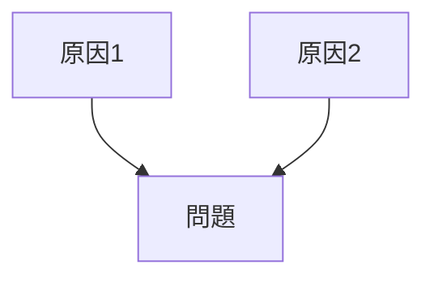

 # 原因分析構造  
  
問題を生む原因を特定する。  
  
---  
  
# 因果構造
原因  
↓  
結果

---  

# 構造図  
  

---  

# 分析方法
- [[02_zettelkasten/Zettelkasten Engine/03_process/methods/analysis/なぜなぜ分析]]
- [[02 cause analysis]]
- システム分析

---  
  
