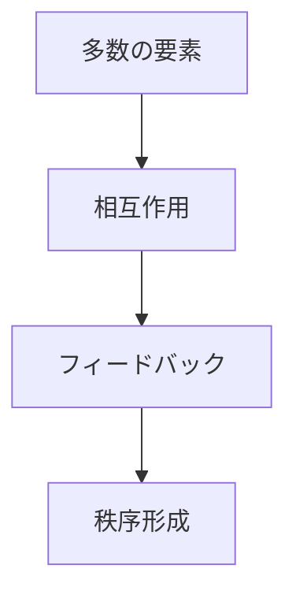
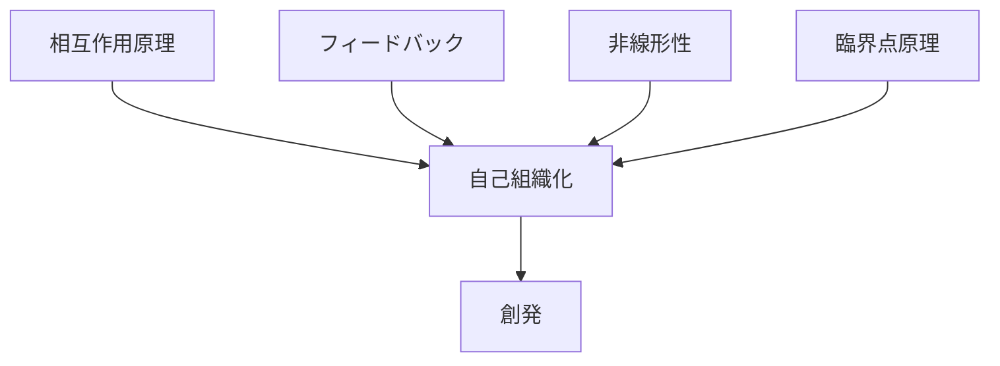

# 自己組織化

## 定義

中央の制御者が存在しないにもかかわらず、  
要素同士の相互作用によって

**秩序・構造・パターンが自発的に形成される現象**

を **自己組織化（Self-Organization）** という。

---

# 基本構造



---

# 要点

自己組織化は

```
中央制御
なし
```

でも

```
秩序
構造
パターン
```

が生まれることを意味する。

---

# 起こる条件

## 多数の要素

例

- 個体
- 細胞
- 人
- ノード

---

## 相互作用

要素同士が影響し合う。

---

## フィードバック

結果が再び原因へ戻る。

---

## 非線形性

変化が単純加算ではない。

---

# kernelとの関係



---

# 創発との関係

|概念|意味|
|---|---|
自己組織化|秩序が生まれるプロセス|
創発|その結果として現れる新しい性質|

つまり

```
自己組織化
↓
創発
```

である。

---

# 各分野の例

## 生物

- 蟻のコロニー
- 魚群
- 細胞組織

---

## 社会

- 市場形成
- 都市形成
- SNSコミュニティ

---

## 物理

- 雪の結晶
- 対流パターン
- 結晶構造

---

## 技術

- インターネット
- 分散ネットワーク
- ブロックチェーン

---

# pattern

自己組織化から現れる典型パターン

- 群集行動
- 市場秩序
- 都市構造
- 技術エコシステム

---

# case

- 蟻の巣
- 魚群行動
- 交通流
- 株式市場

---

# 見分けるための問い

- 中央制御者が存在するか
- 要素同士が相互作用しているか
- フィードバックがあるか
- パターンが自然に形成されているか

---

# 要約

自己組織化とは

**多数の要素の相互作用によって  
中央制御なしに秩序が形成される現象**

である。