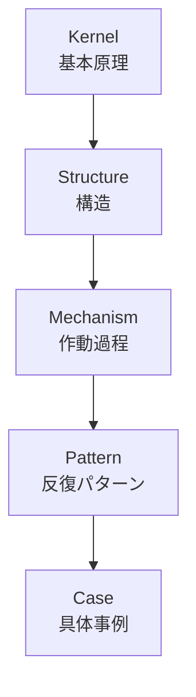
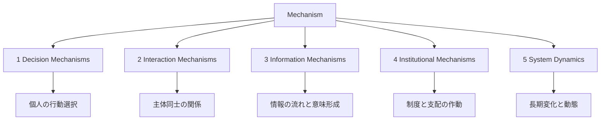
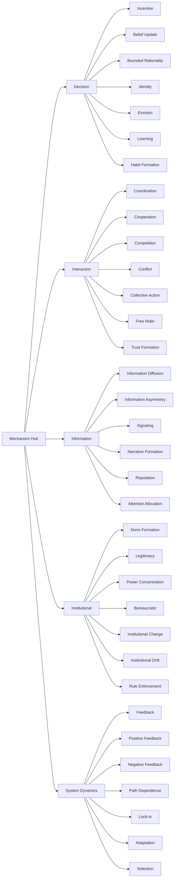

# Mechanism Hub

Mechanism は、**structure がどのように動くか**、  
つまり **因果的に何が作動して、どのような結果が生まれるか** を記述する層である。

structure が「構造の型」であるなら、mechanism は「その構造を動かす作動原理」である。  
pattern が「繰り返し現れる典型的結果」であるなら、mechanism は「その結果を生む過程」である。

---

# Mechanism 層の位置づけ

---

# Mechanism とは何か

Mechanism は、対象を静止画ではなく**動態**として理解するためのノートである。

たとえば、

- structure は「権力構造」「情報非対称構造」「習慣ループ」などの配置を示す
- mechanism は「なぜ権力が集中するのか」「どう情報格差が歪みを生むのか」「どう習慣が維持されるのか」を示す

つまり mechanism は、  
**A という条件のもとで、B が作動し、C という結果が出る**  
という **因果の中間過程** を書く層である。

---

# 読み方

Mechanism ノートを読むときは、次の順で見ると使いやすい。

1. **何が作動主体か**
   - 個人か
   - 集団か
   - 制度か
   - システム全体か

2. **何が入力条件か**
   - 資源
   - 情報
   - 利害
   - 期待
   - 制約
   - 外部環境

3. **どのような過程で変化が起きるか**
   - 増幅
   - 抑制
   - 調整
   - 選抜
   - 拡散
   - 固定化

4. **何が結果として出るか**
   - 協力
   - 対立
   - 集中
   - 慣性
   - 炎上
   - 制度変化
   - 淘汰

---

# Mechanism の5分類

---

# 1. Decision Mechanisms

個人や単一主体が、何を選び、どう更新し、なぜその行動を取るかを扱う。

## 一覧

- [[Incentive Mechanism]]
- [[02_zettelkasten/Zettelkasten Engine/02_knowledge/world_model/mechanism/decision/信念更新メカニズム]]
- [[02_zettelkasten/Zettelkasten Engine/02_knowledge/world_model/mechanism/decision/限定合理性メカニズム]]
- [[Identity Mechanism]]
- [[02_zettelkasten/Zettelkasten Engine/02_knowledge/world_model/mechanism/decision/感情メカニズム]]
- [[Learning Mechanism]]
- [[02_zettelkasten/Zettelkasten Engine/02_knowledge/world_model/mechanism/decision/習慣形成メカニズム]]

## 中心テーマ

- 行動選択
- 信念更新
- 感情駆動
- 学習
- 習慣化
- 制約下の合理性

## 問うこと

- なぜその選択をしたのか
- どうやって信念が変わるのか
- 何が反復行動を固定するのか
- 感情やアイデンティティがどう判断に入るのか

---

# 2. Interaction Mechanisms

複数主体が関わるときに、協調、競争、対立、信頼、集合行動がどう生まれるかを扱う。

## 一覧

- [[Coordination Mechanism]]
- [[Cooperation Mechanism]]
- [[Competition Mechanism]]
- [[Conflict Mechanism]]
- [[Collective Action Mechanism]]
- [[Free Rider Mechanism]]
- [[Trust Formation Mechanism]]

## 中心テーマ

- 相互期待
- 協力と裏切り
- 希少資源競争
- 対立の激化
- 集合行動
- ただ乗り
- 信頼形成

## 問うこと

- なぜ秩序が成立するのか
- なぜ協力が壊れるのか
- なぜ対立が増幅するのか
- どうすれば集団行動が起きるのか
- なぜ信頼が維持されるのか

---

# 3. Information Mechanisms

情報がどう偏在し、伝播し、意味づけられ、評判や物語になるかを扱う。

## 一覧

- [[02_zettelkasten/Zettelkasten Engine/02_knowledge/world_model/mechanism/information/情報拡散メカニズム]]
- [[02_zettelkasten/Zettelkasten Engine/02_knowledge/world_model/mechanism/information/情報非対称メカニズム]]
- [[02_zettelkasten/Zettelkasten Engine/02_knowledge/world_model/mechanism/information/シグナリングメカニズム]]
- [[02_zettelkasten/Zettelkasten Engine/02_knowledge/world_model/mechanism/information/物語形成メカニズム]]
- [[Reputation Mechanism]]
- [[Attention Allocation Mechanism]]

## 中心テーマ

- 情報格差
- 拡散
- シグナル
- 物語化
- 評判形成
- 注意の偏り

## 問うこと

- なぜその情報が広がるのか
- なぜ一方だけが有利な情報を持つのか
- なぜ人は信号に騙される／信じるのか
- どうして物語が動員を生むのか
- 評判はどう蓄積し作用するのか

---

# 4. Institutional Mechanisms

制度、権力、ルール、官僚制、正統性がどう作動し維持・変化するかを扱う。

## 一覧

- [[02_zettelkasten/Zettelkasten Engine/02_knowledge/world_model/mechanism/institutional/規範形成メカニズム]]
- [[Legitimacy Mechanism]]
- [[02_zettelkasten/Zettelkasten Engine/02_knowledge/world_model/mechanism/institutional/権力集中メカニズム]]
- [[02_zettelkasten/Zettelkasten Engine/02_knowledge/world_model/mechanism/institutional/官僚制メカニズム]]
- [[02_zettelkasten/Zettelkasten Engine/02_knowledge/world_model/mechanism/institutional/制度変化メカニズム]]
- [[Institutional Drift Mechanism]]
- [[02_zettelkasten/Zettelkasten Engine/02_knowledge/world_model/mechanism/institutional/ルール執行メカニズム]]

## 中心テーマ

- 規範形成
- 正統性
- 権力集中
- 官僚制
- 制度変化
- 制度ドリフト
- 執行

## 問うこと

- なぜそのルールが当然視されるのか
- なぜ権力が中心に集まるのか
- なぜ制度は変わりにくいのか
- なぜ形式は同じでも実態が変わるのか
- なぜ執行があると秩序が維持されるのか

---

# 5. System Dynamics

システム全体の長期変化、増幅、抑制、固定化、適応、淘汰を扱う。

## 一覧

- [[Feedback Mechanism]]
- [[Positive Feedback Mechanism]]
- [[Negative Feedback Mechanism]]
- [[Path Dependence Mechanism]]
- [[Lock-in Mechanism]]
- [[Adaptation Mechanism]]
- [[Selection Mechanism]]

## 中心テーマ

- 循環因果
- 増幅
- 安定化
- 経路依存
- ロックイン
- 適応
- 選択

## 問うこと

- なぜ小さな差が大きくなるのか
- なぜシステムは元に戻るのか
- なぜ非効率でも続くのか
- どうして変われないのか
- 何が生き残り、何が淘汰されるのか

---

# 全体マップ

---

# Structure との違い

## Structure
- 要素の配置
- 関係の型
- 静的な骨組み

## Mechanism
- その構造がどう作動するか
- 入力から出力への過程
- 時間を含む動態

### 例
- structure: [[情報非対称構造]]
- mechanism: [[02_zettelkasten/Zettelkasten Engine/02_knowledge/world_model/mechanism/information/情報非対称メカニズム]]

- structure: [[02_zettelkasten/Zettelkasten Engine/02_knowledge/world_model/pattern/state/structure/権力構造]]
- mechanism: [[02_zettelkasten/Zettelkasten Engine/02_knowledge/world_model/mechanism/institutional/権力集中メカニズム]]

- structure: [[02_zettelkasten/Zettelkasten Engine/02_knowledge/world_model/pattern/social/structure/規範構造]]
- mechanism: [[02_zettelkasten/Zettelkasten Engine/02_knowledge/world_model/mechanism/institutional/規範形成メカニズム]]

---

# Pattern との違い

## Mechanism
「なぜそうなるか」の過程

## Pattern
「繰り返し現れる典型結果」

### 例
- mechanism: [[Positive Feedback Mechanism]]
- pattern: [[勝者総取り]]

- mechanism: [[Free Rider Mechanism]]
- pattern: [[公共財問題]]

- mechanism: [[02_zettelkasten/Zettelkasten Engine/02_knowledge/world_model/mechanism/information/物語形成メカニズム]]
- pattern: [[02_zettelkasten/Zettelkasten Engine/02_knowledge/world_model/pattern/social/case/陰謀論]]

---

# どの mechanism を使うか

## 個人の判断を説明したい
→ Decision Mechanisms

## 複数主体の協力・対立を見たい
→ Interaction Mechanisms

## 情報・噂・物語・評判を見たい
→ Information Mechanisms

## 制度・権力・正統性・官僚制を見たい
→ Institutional Mechanisms

## 長期変化・固定化・淘汰を見たい
→ System Dynamics

---

# 典型的な使い方

## 1. case から上がる
具体事例を見て「何の mechanism が動いたか」を特定する。

例  
- SNS炎上  
  → [[Attention Allocation Mechanism]]  
  → [[02_zettelkasten/Zettelkasten Engine/02_knowledge/world_model/mechanism/information/情報拡散メカニズム]]  
  → [[02_zettelkasten/Zettelkasten Engine/02_knowledge/world_model/mechanism/information/物語形成メカニズム]]  
  → [[Reputation Mechanism]]

## 2. pattern から下がる
パターンを見て、その背後の mechanism を分解する。

例  
- [[寡占化]]  
  → [[Competition Mechanism]]  
  → [[Positive Feedback Mechanism]]  
  → [[Lock-in Mechanism]]

## 3. structure と接続する
静的構造だけでは説明できないとき、作動過程として mechanism を追加する。

例  
- [[02_zettelkasten/Zettelkasten Engine/02_knowledge/world_model/pattern/organization/structure/官僚制構造]]  
  → [[02_zettelkasten/Zettelkasten Engine/02_knowledge/world_model/mechanism/institutional/官僚制メカニズム]]  
  → [[Institutional Drift Mechanism]]

---

# 関連 Hub

- [[Structure Hub]]
- [[old_zettelkasten/pattern/Pattern Hub]]
- [[02_zettelkasten/Zettelkasten Engine/02_knowledge/world_model/model_hub/Kernel Hub]]
- [[World Model Hub]]
- [[Human Model Hub]]
- [[Social Model Hub]]
- [[System Model Hub]]

---

# 補助メモ

Mechanism ノートを書くときは、最低でも以下を入れると崩れにくい。

- 定義
- 概要
- Kernel
- 基本構造
- メカニズム
- 成立条件 / 失敗条件
- 発生するPattern
- Case
- 関連ノート

Mechanism は **説明力の中核** なので、  
「何があるか」よりも  
**どう動くか / なぜそうなるか** を必ず明示する。