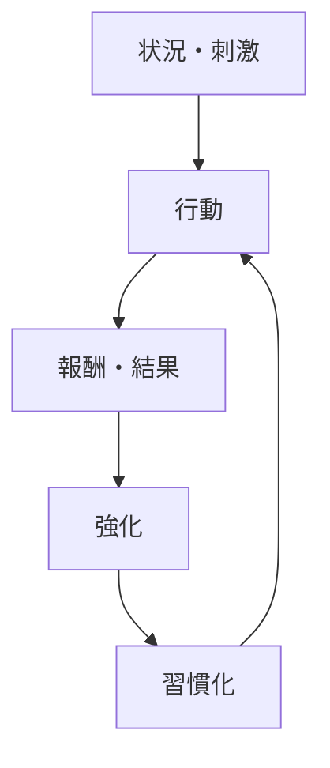
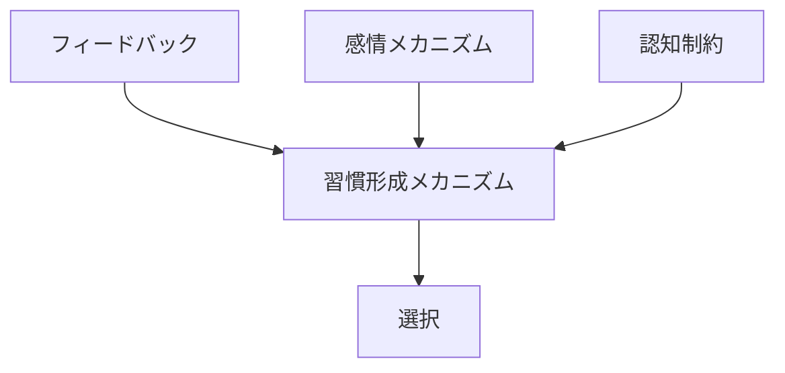

# 習慣形成メカニズム

## 定義

行動が繰り返され、その結果として

**特定の状況でほぼ自動的に同じ行動が引き起こされるようになる過程**

を **習慣形成メカニズム** という。

---

# 基本構造



つまり

```
刺激
↓
行動
↓
結果
↓
強化
↓
自動化
```

である。

---

# 習慣の特徴

## 1 自動性

習慣化された行動は

```
意識的意思決定
```

をほとんど必要としない。

---

## 2 文脈依存

習慣は

```
特定の状況
```

と結びつく。

例

- 朝コーヒーを飲む  
- 仕事後にSNSを見る  

---

## 3 意志の影響が小さい

習慣は

```
意志
```

よりも

```
環境刺激
```

によって起こる。

---

# kernelとの関係



---

# フィードバックとの関係

習慣形成は

```
行動
↓
結果
↓
フィードバック
```

によって強化される。

---

# 感情との関係

報酬に

- 快感
- 達成感
- 安心

などの感情が伴うと

習慣化しやすい。

---

# 認知制約との関係

人間は

```
すべてを意思決定
```

すると負荷が大きすぎる。

習慣は

```
認知コスト削減
```

の仕組みでもある。

---

# 習慣形成の段階

## 1 行動開始

意識的行動。

---

## 2 行動反復

行動が繰り返される。

---

## 3 行動強化

成功体験や報酬が行動を強化する。

---

## 4 自動化

刺激が来ると自動的に行動が起こる。

---

# 各領域での例

## 個人生活

- 運動習慣
- 読書習慣
- スマホチェック

---

## 組織

- 定例会議
- 業務手順
- 報告プロセス

---

## 社会

- 文化的慣習
- 日常儀礼

---

# pattern

習慣形成から現れるパターン

- 慣性行動
- ルーチン
- 行動固定
- 行動抵抗

---

# case

- 毎朝の運動
- 毎日同じ通勤ルート
- 定時のSNSチェック
- 業務ルーチン

---

# 見分けるための問い

- その行動はどの刺激で起こるか
- 行動はどれくらい反復されているか
- 行動の報酬は何か
- 意識的判断が必要か
- 環境が変わると行動は変わるか

---

# 要約

習慣形成メカニズムとは

**反復された行動が報酬やフィードバックによって強化され、特定の状況で自動的に実行されるようになる仕組み**

である。

したがって多くの行動は

```
意思決定
```

ではなく

```
習慣
```

によって支えられている。