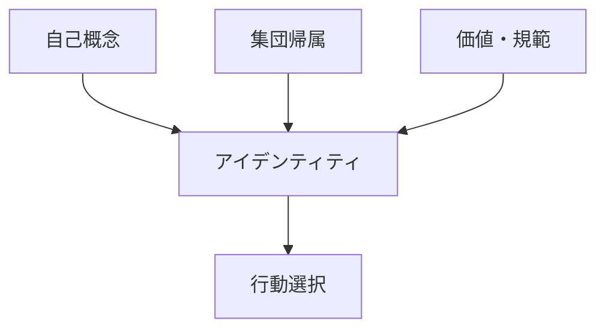
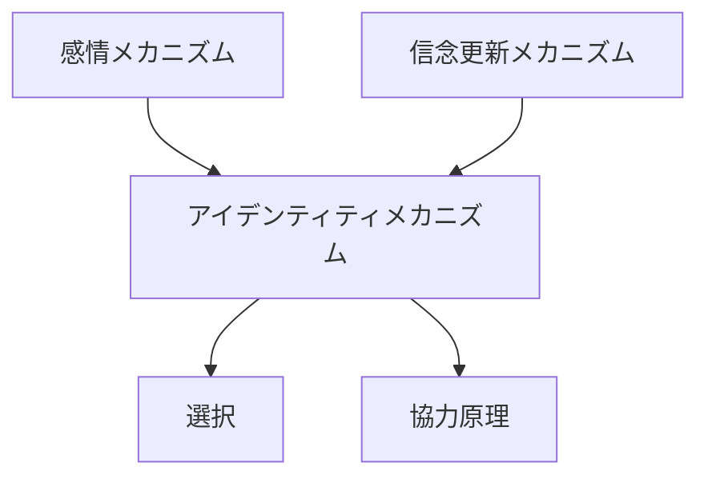

# アイデンティティメカニズム

## 定義

主体が

- 自分は何者か
- どの集団に属するか
- どんな価値観を持つか

という **自己認識（アイデンティティ）** を基準に  
行動・判断・態度を決定する仕組みを

**アイデンティティメカニズム**という。

---

# 基本構造



つまり

```
自己認識
↓
価値・役割
↓
行動選択
```

である。

---

# アイデンティティの機能

## 1 行動の一貫性

主体は

```
自分らしい行動
```

を維持しようとする。

例

- 「私は研究者だ」
- 「私はプロだ」

---

## 2 集団帰属

人は

```
どの集団の一員か
```

によって行動を変える。

例

- 国民
- 職業
- コミュニティ

---

## 3 規範の内面化

外部ルールが

```
自己の価値観
```

として取り込まれる。

例

- 職業倫理
- 社会規範
- 道徳

---

# kernelとの関係



---

# 信念更新との関係

アイデンティティは

```
信念のフィルター
```

として働く。

主体は

```
自己像に合う情報
```

を受け入れやすい。

---

# 感情との関係

アイデンティティは

- 誇り
- 恥
- 羞恥
- 忠誠

などの感情と結びつく。

---

# インセンティブとの関係

行動は

```
金銭的利益
```

だけでなく

```
自己像の維持
```

によっても動く。

例

- 名誉
- プロ意識
- 義務感

---

# 各領域での例

## 個人

- 職業アイデンティティ
- 趣味コミュニティ
- 文化的自己認識

---

## 組織

- 組織文化
- プロ