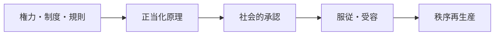

# Legitimacy Mechanism

Legitimacy Mechanism（正統性メカニズム）とは、ある主体、制度、権力、規則、命令が「従うに値する」「妥当である」「受け入れるべきだ」と認識される仕組みである。

---

# 概要

権力は暴力や資源だけでは長期的に安定しない。  
人々がその支配や制度を、少なくともある程度は正当とみなすとき、統治コストは下がり、命令は自発的服従に近づく。  
正統性は、伝統、法、成果、手続、公正、神聖性、専門性などから供給される。

正統性メカニズムの核心は、

1. 支配・制度の提示
2. 正当化原理
3. 社会的承認
4. 服従の自発化
5. 再生産

にある。

---

# Kernel

- [[正当化原理]]
- [[権威原理]]
- [[制度信頼原理]]
- [[社会的承認原理]]

---

# 基本構造

---

# メカニズム

## 1. 支配対象の提示
国家、組織、宗教、専門家、法制度などが一定の命令・規則・判断を提示する。

## 2. 正当化の供給
それが「伝統だから」「合法だから」「成果を出しているから」「専門家だから」などの形で説明される。

## 3. 承認の獲得
被支配者や参加者が、その説明を妥当だと受け取り、少なくとも公然とは否定しない。

## 4. 服従の自発化
命令や規則が、常時の強制なしでも守られるようになる。

## 5. 再生産
服従と承認の積み重ねが、制度や支配の安定性そのものを高める。

---

# 正統性の主要源泉

## 伝統的正統性
昔からそうであることに基づく。

## 法的正統性
手続やルールに従って成立していることに基づく。

## 成果的正統性
秩序、繁栄、安全、成果を生み出していることに基づく。

## カリスマ的正統性
特別な人物性や象徴性に基づく。

## 専門的正統性
知識、資格、技術能力への信頼に基づく。

---

# 崩壊条件

- 手続の不公正
- 成果の失敗
- 汚職や偽善の露見
- 正当化物語の失効
- 対抗的正統性の台頭

---

# 発生するPattern

- [[制度信頼]]
- [[権威服従]]
- [[統治安定]]
- [[正統性危機]]
- [[革命前夜]]
- [[専門家支配]]

---

# Case

- 憲法秩序への服従
- 官僚機構への信頼
- 王権神授の受容
- カリスマ指導者への支持
- 裁判所判断への従属

---

# 関連ノート

- [[02_zettelkasten/Zettelkasten Engine/02_knowledge/world_model/mechanism/institutional/規範形成メカニズム]]
- [[Reputation Mechanism]]
- [[02_zettelkasten/Zettelkasten Engine/02_knowledge/world_model/mechanism/institutional/ルール執行メカニズム]]
- [[02_zettelkasten/Zettelkasten Engine/02_knowledge/world_model/mechanism/institutional/権力集中メカニズム]]