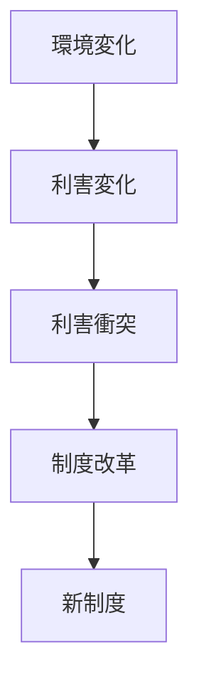
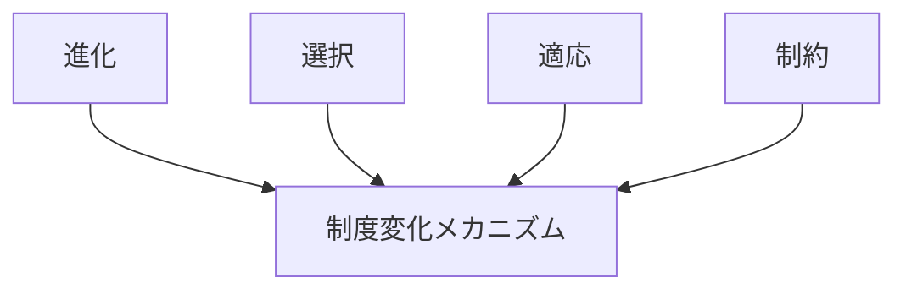

# 制度変化メカニズム

## 定義

社会の

- ルール
- 法律
- 組織構造
- 慣習
- 規範

などの **制度** が、環境・利害・情報の変化によって  
徐々に、または急激に変化していく仕組みを

**制度変化メカニズム** という。

---

# 基本構造



つまり

```text
環境変化
↓
利害変化
↓
衝突・調整
↓
制度変更
```

である。

---

# 制度とは何か

制度とは

```
行動を制約するルール体系
```

である。

例

- 法律
- 契約
- 社会規範
- 組織ルール

---

# 制度変化が起きる原因

## 1 環境変化

環境が変わると  
既存制度が適合しなくなる。

例

- 技術革新
- 人口変化
- 経済構造変化

---

## 2 利害対立

制度は特定の利害構造を反映するため、  
利害が変わると制度変更圧力が生まれる。

例

- 新産業
- 新階層
- 新勢力

---

## 3 制度の内部矛盾

制度が

```
現実と合わなくなる
```

と変更される。

例

- 非効率
- 不公平
- 実行不能

---

## 4 外部ショック

突然の事件によって制度が急変する。

例

- 戦争
- 危機
- 革命

---

# kernelとの関係



制度変化は

```
制度の進化
```

として理解できる。

---

# 進化との関係

制度は

```
変異
↓
選択
↓
定着
```

という進化過程をたどる。

---

# 適応との関係

制度は環境に

```
適応
```

しようとする。

適応できない制度は  
淘汰される。

---

# 制約との関係

制度は同時に

```
行動制約
```

でもある。

制度変更は

```
制約の再設計
```

でもある。

---

# 制度変化のパターン

## 漸進的変化

少しずつ修正される。

例

- 法改正
- 規則改定

---

## 制度ドリフト

制度が変わらないまま  
環境だけが変化する。

---

## 制度転換

制度が大きく変わる。

例

- 政体変更
- 経済制度改革

---

## 制度崩壊

制度が機能しなくなる。

例

- 国家崩壊
- 組織破綻

---

# 各領域での例

## 国家

- 憲法改正
- 行政改革
- 政治制度改革

---

## 経済

- 市場制度
- 金融制度
- 規制制度

---

## 組織

- 経営制度
- 人事制度
- ガバナンス

---

## 社会

- 家族制度
- 教育制度
- 社会規範

---

# pattern

制度変化メカニズムから現れるパターン

- パス依存
- 制度ロックイン
- 制度崩壊
- 制度改革
- 制度競争

---

# case

- 明治維新
- 行政改革
- EU統合
- 社会保障制度改革
- 企業ガバナンス改革

---

# 見分けるための問い

- どの制度が変化しているか
- どの環境変化が原因か
- 誰が制度変更を望んでいるか
- 誰が制度維持を望んでいるか
- 制度変化は漸進か急変か

---

# 要約

制度変化メカニズムとは

**社会のルール体系が、環境・利害・情報の変化に応じて進化・転換する仕組み**

であり、

```text
環境変化
↓
利害変化
↓
衝突
↓
制度改革
```

というプロセスを通じて  
社会制度は更新され続ける。