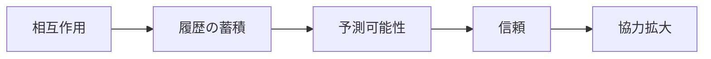

# Trust Formation Mechanism

Trust Formation Mechanism（信頼形成メカニズム）とは、主体間で「相手は予測可能であり、一定程度こちらを裏切らない」とみなせる関係が形成される仕組みである。

---

# 概要

信頼は単なる好意ではない。  
不確実性がある状況で、それでも相手に依存することを可能にする期待構造である。

信頼形成メカニズムの核心は、

1. 過去履歴
2. 一貫性の観察
3. 評判の媒介
4. 制裁可能性
5. 関係継続期待

にある。

---

# Kernel

- [[繰り返し相互作用原理]]
- [[評判原理]]
- [[予測可能性原理]]
- [[制裁原理]]

---

# 基本構造

---

# メカニズム

## 1. 行動履歴の観察
過去に約束を守った、裏切らなかった、責任を負った、という履歴が蓄積される。

## 2. 一貫性の認識
状況が変わっても一定の行動原理を保つ主体は予測可能とみなされやすい。

## 3. 評判の流通
直接経験がなくても、第三者評価や社会的信用によって信頼が代替的に形成される。

## 4. 制裁可能性の存在
裏切れば失うものが大きいと分かっているほど、相手は信頼に値すると判断されやすい。

## 5. 関係継続の期待
将来も関係が続くと見込まれるほど、短期的裏切りより長期的信用維持が合理的になる。

---

# 成立条件

- 行動履歴が観察可能
- 相手の一貫性がある
- 評判が共有される
- 裏切りコストが高い
- 関係が一回限りでない

---

# 崩壊条件

- 履歴が見えない
- 一貫性がない
- 評判が偽装される
- 裏切り得が大きい
- 関係が断続的すぎる

---

# 発生するPattern

- [[信用取引]]
- [[契約関係]]
- [[ブランド信頼]]
- [[共同体秩序]]
- [[人的ネットワーク]]

---

# Case

- 商取引の継続発注
- 地域共同体での役割分担
- BtoBの長期取引
- 医師や士業への信頼
- プラットフォーム上の出品者評価

---

# 関連ノート

- [[Cooperation Mechanism]]
- [[Reputation Mechanism]]
- [[02_zettelkasten/Zettelkasten Engine/02_knowledge/world_model/mechanism/institutional/ルール執行メカニズム]]
- [[02_zettelkasten/Zettelkasten Engine/02_knowledge/world_model/mechanism/information/情報非対称メカニズム]]