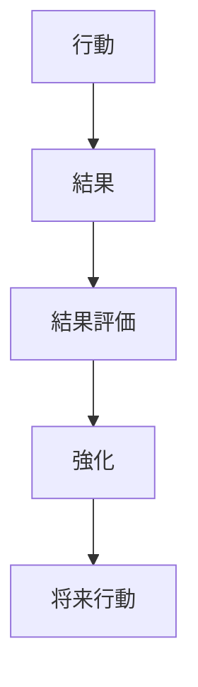
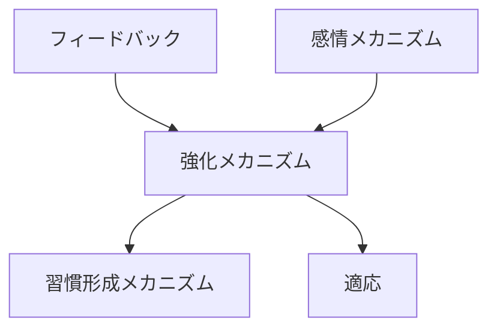

# 強化メカニズム

## 定義

行動の結果として得られる

- 報酬  
- 不快の回避  
- 成功体験  

などが、その行動の将来の発生確率を変化させる仕組みを  
**強化メカニズム（Reinforcement Mechanism）**という。

---

# 基本構造



つまり

```
行動
↓
結果
↓
評価
↓
行動確率変化
```

である。

---

# 強化の種類

## 正の強化

行動の結果として  
**報酬が得られる**

例

- 成績が良い → 褒められる  
- 売上成功 → ボーナス  

結果

```
行動増加
```

---

## 負の強化

行動によって  
**不快が除去される**

例

- 勉強 → 不安減少  
- 修理 → 異音消失  

結果

```
行動増加
```

---

## 罰

行動の結果として  
**不快が与えられる**

例

- 違反 → 罰金  

結果

```
行動減少
```

---

## 消去

報酬がなくなる。

例

- SNS投稿に反応がなくなる  

結果

```
行動消失
```

---

# kernelとの関係



---

# フィードバックとの関係

強化は

```
行動結果
↓
フィードバック
```

によって発生する。

---

# 感情との関係

報酬や罰は

- 喜び
- 不快
- 安心
- 恐怖

といった感情を伴い、  
強化効果を高める。

---

# 習慣形成との関係

強化は習慣形成の基盤である。

```
行動
↓
強化
↓
反復
↓
習慣
```

---

# 適応との関係

生物や組織は

```
成功行動
```

を強化することで  
環境に適応する。

---

# 各領域での例

## 個人行動

- 勉強 → 成績向上 → 勉強継続  
- 運動 → 気分改善 → 運動習慣  

---

## 経済

- 利益 → 投資拡大  
- 赤字 → 戦略変更  

---

## 組織

- 成功プロジェクト → 手法標準化  
- 失敗プロジェクト → 手順改善  

---

## AI

- 強化学習  
- 報酬最大化

---

# pattern

強化メカニズムから現れるパターン

- 成功戦略固定
- 行動習慣化
- 報酬依存
- 失敗回避

---

# case

- ゲームのレベルアップ報酬
- SNSのいいね
- 営業インセンティブ
- スポーツトレーニング

---

# 見分けるための問い

- どの行動が強化されているか  
- 行動の結果は何か  
- どんな報酬または回避があるか  
- 行動頻度はどう変化したか  

---

# 要約

強化メカニズムとは

**行動の結果によってその行動の将来の発生確率が変化する仕組み**

であり、

```
行動
↓
結果
↓
強化
↓
行動変化
```

という循環を通じて  
学習・習慣・適応を生み出す。