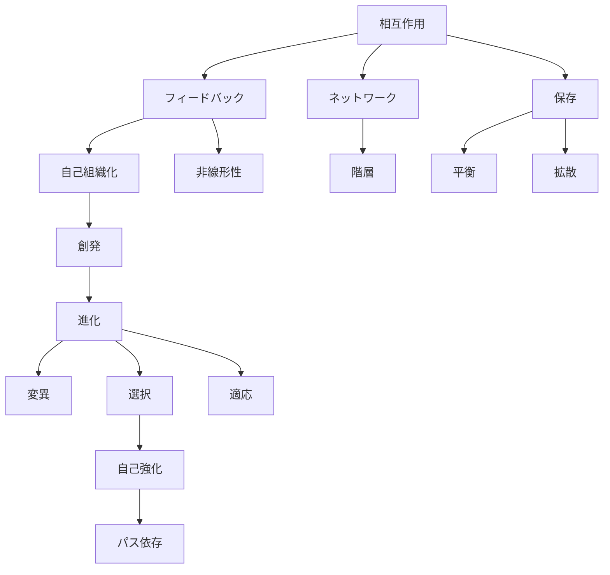

# Kernel Hub

Kernel は世界に共通する **最も基本的な原理**である。

これらは

- 物理
- 生物
- 人間
- 社会

など多くの領域に共通して現れる。

---

# Kernel構造



---

# Kernel Cross Domain Table

| Kernel  | physical | biological | human  | social   |
| ------- | -------- | ---------- | ------ | -------- |
| 相互作用    | 力・場      | 生物相互作用     | 対人相互作用 | 社会関係     |
| 保存      | エネルギー保存  | 代謝エネルギー    | 注意資源   | 資源配分     |
| 拡散      | 熱拡散      | 物質拡散       | 情報拡散   | 情報伝播     |
| 平衡      | 熱平衡      | 恒常性        | 心理安定   | 制度安定     |
| 非線形性    | カオス      | 生態系変動      | 感情増幅   | 市場変動     |
| フィードバック | 制御系      | ホメオスタシス    | 学習     | 市場調整     |
| 自己組織化   | 結晶       | 群れ         | 習慣形成   | 都市形成     |
| 創発      | 相転移      | 生命         | 意識     | 社会秩序     |
| ネットワーク  | 分子結合     | 神経系        | 社会関係   | 通信網      |
| 階層      | 粒子→物質    | 細胞→個体      | 個人→集団  | 組織→国家    |
| 変異      | 量子揺らぎ    | 遺伝子変異      | 発想     | 制度革新     |
| 選択      | 安定構造     | 自然選択       | 意思決定   | 市場競争     |
| 適応      | 平衡調整     | 進化適応       | 行動適応   | 制度適応     |
| パス依存    | 履歴効果     | 進化史        | 習慣     | 制度慣性     |
| 自己強化    | 増幅現象     | 繁殖成功       | 動機強化   | ネットワーク効果 |

---

# Kernel一覧

## 物理原理

- [[02_zettelkasten/Zettelkasten Engine/02_knowledge/world_model/meta/kernel/physics/相互作用原理]]
- [[02_zettelkasten/Zettelkasten Engine/02_knowledge/world_model/meta/kernel/physics/保存原理]]
- [[02_zettelkasten/Zettelkasten Engine/02_knowledge/world_model/meta/kernel/physics/拡散原理]]
- [[02_zettelkasten/Zettelkasten Engine/02_knowledge/world_model/meta/kernel/physics/平衡化原理]]

---

## 複雑系原理

- [[非線形性]]
- [[フィードバック]]
- [[02_zettelkasten/Zettelkasten Engine/02_knowledge/world_model/meta/kernel/complex/自己組織化]]
- [[02_zettelkasten/Zettelkasten Engine/02_knowledge/world_model/meta/kernel/complex/創発]]
- [[02_zettelkasten/Zettelkasten Engine/02_knowledge/world_model/meta/model/system/network/ネットワーク原理]]
- [[02_zettelkasten/Zettelkasten Engine/02_knowledge/world_model/meta/kernel/physics/階層原理]]

---

## 進化原理

- [[02_zettelkasten/Zettelkasten Engine/02_knowledge/world_model/mechanism/evolution/変異]]
- [[02_zettelkasten/Zettelkasten Engine/02_knowledge/world_model/concept/選択]]
- [[02_zettelkasten/Zettelkasten Engine/02_knowledge/world_model/meta/kernel/evolution/適応]]
- [[02_zettelkasten/Zettelkasten Engine/02_knowledge/world_model/model/system/evolution/パス依存]]
- [[02_zettelkasten/Zettelkasten Engine/02_knowledge/world_model/model/system/evolution/自己強化過程]]

---

# 位置づけ

Kernel は **世界モデルの最上位原理**であり

```
Kernel
↓
Structure
↓
Model
↓
Case
```

という知識構造の基盤になる。