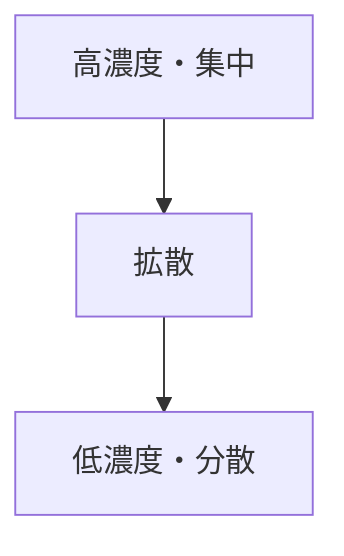
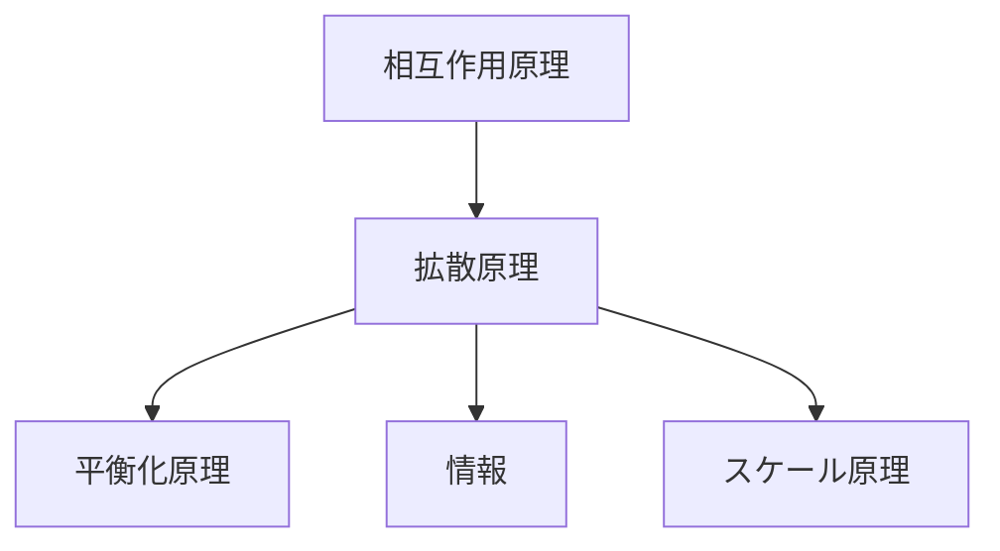

# 拡散原理

## 定義

ある物質・情報・影響が

**高い集中状態から低い集中状態へ広がる傾向**

を **拡散原理** という。

簡単に言えば

**偏りは広がって薄まる**

という原理である。

---

# 基本構造



拡散とは

```
集中
↓
広がり
↓
均質化
```

である。

---

# 拡散の本質

## 1 濃度差が駆動力

拡散は

```
濃度差
密度差
圧力差
温度差
```

などの差によって起こる。

差が大きいほど  
拡散は速くなる。

---

## 2 接触が必要

拡散は

```
相互作用
接触
ネットワーク
```

を通じて起こる。

---

## 3 時間とともに広がる

拡散は通常

```
時間
↓
分布拡大
```

の形で進む。

---

# kernelとの関係



---

# 平衡化原理との関係

拡散は

```
差
↓
移動
↓
均衡
```

という過程である。

したがって拡散は

**平衡化の主要メカニズム**

である。

---

# 各領域での例

## 物理

- 熱伝導
- ガス拡散
- 分子拡散

---

## 生物

- 化学物質拡散
- フェロモン拡散
- 病原体拡散

---

## 社会

- 流行拡散
- 技術普及
- 情報拡散

---

## 経済

- 価格情報拡散
- 商品普及
- 市場影響

---

## 都市・交通

- 交通混雑拡散
- 都市拡大
- 需要拡散

---

# 拡散のパターン

拡散にはいくつかの典型形がある。

### 同心円拡散

中心から外側へ広がる

例  
都市拡大

---

### ネットワーク拡散

接続関係に沿って広がる

例  
SNS拡散

---

### 階層拡散

中心都市や影響力主体から広がる

例  
文化拡散

---

# mechanism

拡散に関係するメカニズム

- 情報拡散
- 感染拡散
- 模倣
- 伝播
- カスケード

---

# pattern

拡散から現れやすいパターン

- 流行
- バズ
- 技術普及
- 感染拡大
- 市場波及

---

# case

- SNSバズ
- ウイルス感染
- 技術普及
- 文化拡散
- 都市拡大

---

# 見分けるための問い

- 何が広がっているか
- どこから広がっているか
- どのネットワークを通っているか
- 拡散速度を決める要因は何か
- どこで拡散が止まるか

---

# 要約

拡散原理とは

**集中した状態が周囲へ広がり、分布が均されていく傾向**

である。

物理・生物・社会・経済など  
多くのシステムで見られる基本原理である。