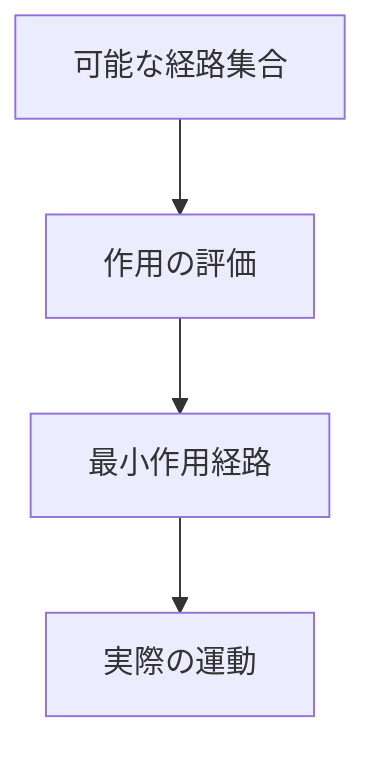
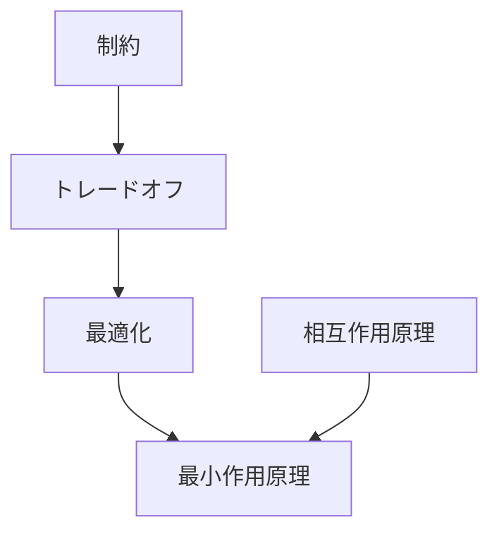

# 最小作用原理

## 定義

自然界の多くの現象は、  
ある量（作用）が

**最小または停留値になる経路**

を選ぶ。

この原理を **最小作用原理** という。

---

# 基本構造



つまり自然は

```
可能な経路
↓
作用を評価
↓
最小作用経路
```

を選ぶ。

---

# 作用とは何か

作用とは

**エネルギーの時間積分**

である。

簡単に言うと

```
運動のコスト
```

のような量である。

---

# 原理の意味

最小作用原理は

```
自然は効率的な経路をとる
```

という性質を表している。

これは

- 力学
- 光学
- 量子力学
- 相対論

など多くの理論の基礎になっている。

---

# 代表例

## 光の経路

光は

```
最短時間
```

の経路を通る。

これは **フェルマーの原理** と呼ばれる。

---

## 力学

物体の運動は

```
作用が最小になる軌道
```

をとる。

---

## 経路最適化

自然界では

- 水流
- 電流
- 物体運動

などが

**最小コスト経路**

を形成する。

---

# kernelとの関係



---

# 制約との関係

最小作用原理は

```
制約の中で
最も効率的な運動
```

を選ぶ。

---

# トレードオフとの関係

運動には

- エネルギー
- 距離
- 時間

などのトレードオフがある。

最小作用原理は  
そのバランスの結果である。

---

# 各分野の例

## 物理

- 光の屈折
- 力学運動
- 量子経路

---

## 生物

- エネルギー効率行動
- 最小労力移動

---

## 社会

- 最短経路移動
- 最小コスト物流

---

## 技術

- ナビゲーション
- ネットワーク最短経路

---

# pattern

最小作用原理から現れやすいパターン

- 最短経路
- 最小コスト構造
- 効率的運動
- 安定軌道

---

# case

- 光の屈折
- 水流経路
- 人の最短移動
- 電流経路

---

# 見分けるための問い

- どの量が最小化されているか
- 他の経路と比較して何が少ないか
- どの制約の下で最小になっているか
- 経路が変わるとコストはどう変わるか

---

# 要約

最小作用原理とは

**自然現象は作用が最小になる経路をとる**

という基本原理であり、  
自然の運動や構造を統一的に説明する枠組みである。