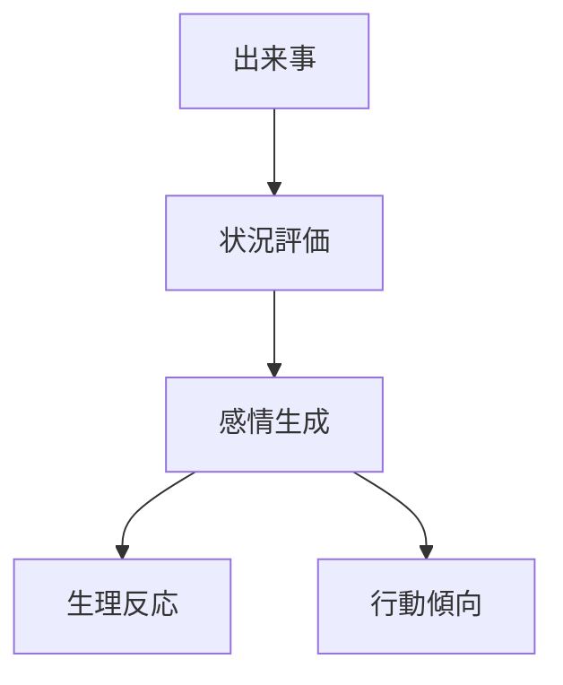
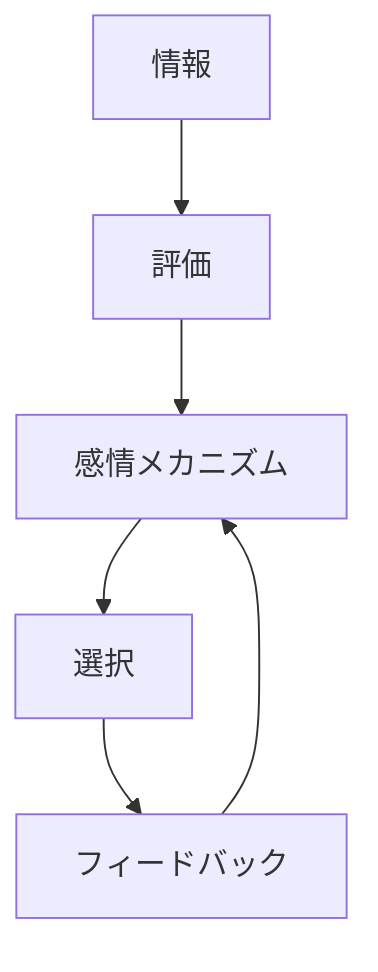

# 感情メカニズム

## 定義

主体が出来事や状況を評価した結果として

**生理反応・主観感覚・行動傾向を伴う状態を生成し、行動や判断を調整する仕組み**

を **感情メカニズム** という。

---

# 基本構造



つまり

```text
出来事
↓
意味評価
↓
感情
↓
行動傾向
```

である。

---

# 感情の機能

## 1 行動を素早く決める

感情は

```
詳細計算
```

の代わりに

```
即時判断
```

を可能にする。

例

- 恐怖 → 回避
- 怒り → 対抗
- 喜び → 接近

---

## 2 注意を集中させる

感情は

```
重要な対象
```

に注意を向ける。

例

- 危険
- 機会
- 社会評価

---

## 3 社会的シグナル

感情表現は

```
他者への情報
```

でもある。

例

- 笑顔 → 協力
- 怒り → 境界防衛
- 恥 → 社会規範遵守

---

# kernelとの関係



---

# 信念更新との関係

感情は

```
情報の重み付け
```

を変える。

例

- 恐怖 → 危険情報を過大評価
- 喜び → 楽観的判断

---

# 認知制約との関係

感情は

```
複雑な判断
```

を

```
単純化
```

する。

つまり

```
高速意思決定装置
```

として働く。

---

# フィードバックとの関係

感情は結果によって更新される。

例

- 成功 → 喜び → 行動強化
- 失敗 → 不安 → 回避

---

# 基本感情

多くの研究では次の感情が基本とされる。

- 喜び
- 怒り
- 恐怖
- 悲しみ
- 嫌悪
- 驚き

---

# 各領域での例

## 個人行動

- 危険回避
- モチベーション
- 習慣形成

---

## 経済

- 消費衝動
- 投資パニック
- バブル心理

---

## 社会

- 群衆行動
- 炎上
- 共感

---

## 組織

- チーム士気
- リーダー信頼
- 組織不満

---

# pattern

感情メカニズムから現れるパターン

- 恐怖拡散
- 群衆熱狂
- 道徳的憤り
- 共感連鎖

---

# case

- パニック売り
- スポーツ観戦の熱狂
- SNS炎上
- 災害時の恐怖伝播

---

# 見分けるための問い

- どの出来事が感情を引き起こしたか
- その出来事はどう評価されたか
- どんな感情が生成されたか
- その感情はどんな行動傾向を生んだか
- 感情は社会的にどう表現されたか

---

# 要約

感情メカニズムとは

**出来事の評価に基づいて感情状態を生成し、行動・判断・社会相互作用を調整する仕組み**

である。

したがって感情は単なる主観ではなく

**意思決定と社会行動を調整する重要なメカニズム**

である。