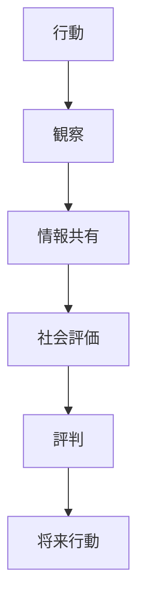
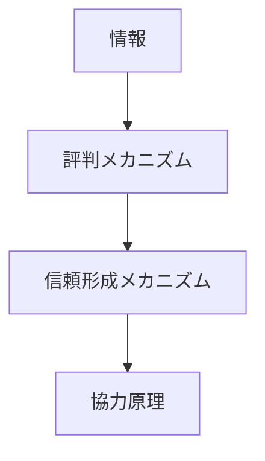

# 評判メカニズム

## 定義

主体の過去の行動に関する情報が

- 他者
- 社会
- 市場

に共有され、

**その評価が将来の信頼・取引・協力に影響する仕組み**

を **評判メカニズム（Reputation Mechanism）** という。

---

# 基本構造



つまり

```
行動
↓
観察
↓
情報共有
↓
評価
↓
評判
↓
将来行動
```

である。

---

# 評判の機能

## 1 信頼の代替

直接経験がなくても

```
評判
```

によって信頼判断ができる。

例

- レビュー
- 紹介
- ブランド

---

## 2 行動の抑制

評判を失うと

- 取引
- 協力
- 社会関係

が失われる。

そのため主体は

```
裏切り
```

を避ける。

---

## 3 長期協力の促進

評判が重要な環境では

```
短期利益
```

より

```
長期信頼
```

が優先される。

---

# kernelとの関係



---

# 信頼との関係

評判は

```
信頼形成の情報源
```

である。

直接経験がなくても

```
第三者情報
```

から信頼が形成される。

---

# 社会規範との関係

規範違反は

```
評判低下
```

を引き起こす。

これが規範遵守を促す。

---

# インセンティブとの関係

評判は

```
非金銭的インセンティブ
```

である。

例

- 名誉
- 信頼
- ブランド

---

# 評判形成の要因

## 行動履歴

過去の行動の蓄積。

---

## 情報伝播

評判は

```
口コミ
レビュー
メディア
```

によって広がる。

---

## 観察可能性

行動が観察されやすいほど評判は形成されやすい。

---

# 各領域での例

## 経済

- ブランド評価
- ECレビュー
- 信用スコア

---

## 社会

- 名声
- 評判
- 社会的評価

---

## 組織

- 社内評価
- キャリア評判

---

## デジタル

- SNSフォロワー
- レビューシステム
- レーティング

---

# pattern

評判メカニズムから現れるパターン

- ブランド形成
- 信用ネットワーク
- 評判競争
- 炎上

---

# case

- Amazonレビュー
- Uber評価
- 口コミ
- ブランド価値

---

# 見分けるための問い

- 誰の評判か
- 評判はどの情報から形成されたか
- 評判はどのように共有されるか
- 評判は行動にどう影響しているか
- 評判はどのくらい持続するか

---

# 要約

評判メカニズムとは

**主体の行動に関する情報が共有され、その評価が将来の信頼・協力・取引に影響する仕組み**

であり、

```
行動
↓
情報共有
↓
評価
↓
評判
↓
行動調整
```

というプロセスを通じて  
社会的協力や市場取引を支える。